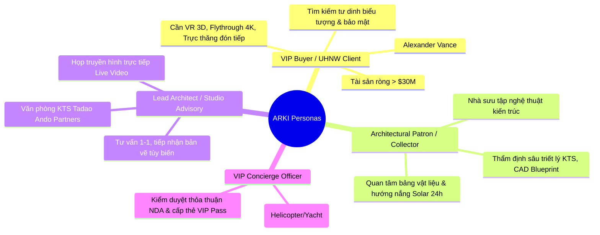
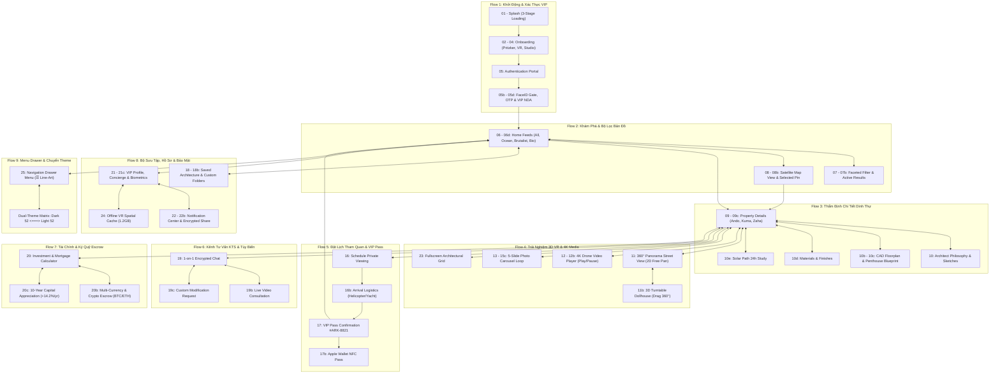

# 🏛️ TỔNG HỢP TOÀN DIỆN LUỒNG NGHIỆP VỤ, USER STORIES & USE CASES
## ỨNG DỤNG BẤT ĐỘNG SẢN KIẾN TRÚC SIÊU SANG ARKI (LUXURY ARCHITECTURAL LIVING)
> **Dự án**: ARKI — Luxury Architectural Living & Figma Bridge Ecosystem  
> **Nền tảng**: Mobile iOS (iPhone 16 Pro, $393 \times 852\text{ px}$)  
> **Quy mô hiện tại**: 104 Màn hình độc lập (Dual Themes: 52 Dark + 52 Light), 10 Master Reusable Components, 370+ Prototype Transitions, 6 Flow Starting Points  
> **Tiêu chuẩn thiết kế & Công nghệ**: UIT IE106 (Thiết kế Giao diện Người dùng), Apple HIG, Single Viewport Architecture, 360° Omnidirectional Pan, 3D Turntable Drag, Video Player 4K Dolby Atmos, Binary Buffer Image Injection  
> **Ngày lập báo cáo**: Tháng 09/2026  

---

## 📑 MỤC LỤC
1. [TỔNG QUAN HỆ THỐNG & ĐỐI TƯỢNG SỬ DỤNG (PERSONAS)](#1-tổng-quan-hệ-thống--đối-tượng-sử-dụng-personas)
2. [BẢN ĐỒ PHÂN RÃ CÁC LUỒNG NGHIỆP VỤ CỐT LÕI (9 BUSINESS FLOWS)](#2-bản-đồ-phân-rã-các-luồng-nghiệp-vụ-cốt-lõi-9-business-flows)
   - [Luồng 1: Khởi động, Khám phá & Xác thực Thành viên VIP](#luồng-1-khởi-động-khám-phá--xác-thực-thành-viên-vip-onboarding--biometric-auth-flow)
   - [Luồng 2: Khám phá, Tìm kiếm Nâng cao & Bản đồ Địa lý Vệ tinh](#luồng-2-khám-phá-tìm-kiếm-nâng-cao--bản-đồ-địa-lý-vệ-tinh-discovery-search--map-flow)
   - [Luồng 3: Thẩm định Chi tiết Kiệt tác Kiến trúc & Triết lý Thiết kế](#luồng-3-thẩm-định-chi-tiết-kiệt-tác-kiến-trúc--triết-lý-thiết-kế-property-details--philosophy-flow)
   - [Luồng 4: Trải nghiệm Không gian Ảo 3D VR, 360° Panorama & Media 4K](#luồng-4-trải-nghiệm-không-gian-ảo-3d-vr-360-panorama--media-4k-immersive-media-flow)
   - [Luồng 5: Đặt lịch Khảo sát Dinh thự VIP, Hậu cần & Cấp Thẻ Thông hành](#luồng-5-đặt-lịch-khảo-sát-dinh-thự-vip-hậu-cần--cấp-thẻ-thông-hành-vip-booking--pass-flow)
   - [Luồng 6: Kênh Trao đổi Trực tiếp KTS Chủ trì & Tùy biến Thiết kế](#luồng-6-kênh-trao-đổi-trực-tiếp-kts-chủ-trì--tùy-biến-thiết-kế-architect-consultation-flow)
   - [Luồng 7: Tính toán Tài chính Đầu tư & Ký quỹ Đa tiền tệ / Crypto Escrow](#luồng-7-tính-toán-tài-chính-đầu-tư--ký-quỹ-đa-tiền-tệ--crypto-escrow-financial--escrow-flow)
   - [Luồng 8: Quản lý Bộ sưu tập, Hồ sơ VIP Patron & Bộ nhớ Đệm Offline VR](#luồng-8-quản-lý-bộ-sưu-tập-hồ-sơ-vip-patron--bộ-nhớ-đệm-offline-vr-collection-profile--security-flow)
   - [Luồng 9: Điều hướng Tiện ích Menu Drawer & Chuyển đổi Theme / Ngôn ngữ](#luồng-9-điều-hướng-tiện-ích-menu-drawer--chuyển-đổi-theme--ngôn-ngữ-system-drawer--theme-toggle-flow)
3. [DANH SÁCH & ĐẶC TẢ USER STORIES (US MATRIX)](#3-danh-sách--đặc-tả-user-stories-us-matrix)
4. [ĐẶC TẢ CHI TIẾT CÁC USE CASES TRỌNG TÂM (USE CASE SPECIFICATIONS)](#4-đặc-tả-chi-tiết-các-use-cases-trọng-tâm-use-case-specifications)
5. [MA TRẬN TRUY VẾT YÊU CẦU & MÀN HÌNH THIẾT KẾ (TRACEABILITY MATRIX)](#5-ma-trận-truy-vết-yêu-cầu--màn-hình-thiết-kế-traceability-matrix)
6. [TỔNG KẾT & GIÁ TRỊ THỰC THI](#6-tổng-kết--giá-trị-thực-thi)

---

## 🏛️ 1. TỔNG QUAN HỆ THỐNG & ĐỐI TƯỢNG SỬ DỤNG (PERSONAS)

### 1.1. Bối cảnh Sản phẩm (Product Context)
**ARKI** là ứng dụng di động môi giới và thẩm định kiến trúc bất động sản siêu sang (Ultra-Luxury Architectural Living), tập trung vào các kiệt tác nghỉ dưỡng ven biển, biệt thự bê tông trần thô mộc (Brutalist) và các công trình sinh thái (Biophilic) được sáng tạo bởi các kiến trúc sư đoạt giải **Pritzker** (Tadao Ando, Kengo Kuma, Zaha Hadid).

Ứng dụng không sử dụng phương thức đăng tin thương mại đại trà thông thường mà vận hành theo chuẩn mực **Private Advisory & Off-Market Club**, tích hợp các công nghệ trải nghiệm không gian đột phá:
- **3D Matterport & 360° Panorama Street View**: Khám phá tự do 2D (ngang, dọc, chéo) kết hợp Hotspots định vị không gian.
- **3D Turntable Bóc mái**: Xoay mô hình công trình $360^\circ$ qua cử chỉ kéo vuốt (`ON_DRAG`).
- **Phim tài liệu Flythrough 4K HDR**: Trình chiếu flycam kết hợp công nghệ âm thanh vòm không gian (Spatial Audio Dolby Atmos 7.1.4).
- **Thẩm định Kỹ thuật Chuyên sâu**: Bản vẽ CAD Blueprint 1:100, bảng mẫu vật liệu hoàn thiện thực tế, mô phỏng biểu đồ quỹ đạo mặt trời 24 giờ.
- **Hậu cần Đón tiếp Siêu sang & Ký quỹ Đa tiền tệ**: Đưa đón bằng trực thăng cá nhân / du thuyền hạng sang, xuất thẻ VIP Pass Apple Wallet, ký quỹ tài chính USD/EUR/Crypto (BTC, ETH).

### 1.2. Chân Dung Người Dùng Trọng Tâm (User Personas)

### 1.3. Hệ Thống Đặc Tả Tác Nhân Đầy Đủ (Actors Matrix)

Hệ thống ARKI phân định rõ ràng **6 Tác nhân con người (Human Actors)** và **5 Tác nhân hệ thống / dịch vụ ngoại vi (System Actors)**:

| Mã Actor | Tên Tác Nhân (Actor Name) | Phân Loại | Vai Trò & Trách Nhiệm Cốt Lõi | Phạm Vi Quyền Hạn (Permissions) | Màn Hình Tương Tác Trực Tiếp |
|:---:|---|:---:|---|---|:---:|
| **ACT-01** | **Khách Quan Sát (Guest Observer)** | Người dùng (Public) | Khách vãng lai quan tâm tới kiến trúc, chưa đăng ký VIP hoặc chọn chế độ *"Enter as Guest"*. | Chỉ xem catalog công khai, xem ảnh chụp cơ bản. **Không** xem toạ độ GPS chính xác, **không** xem tài sản kín (Off-market), **không** đặt lịch trực thăng. | `01 - 04`, `05` (Guest Mode), `06` (Public cards) |
| **ACT-02** | **Khách Hàng Tiềm Năng VIP (VIP Buyer)** | Người dùng (Verified VIP) | Khách hàng UHNW đã đăng nhập, quét sinh trắc học FaceID, xác thực mã OTP 6 số và ký thỏa thuận NDA. | Toàn quyền xem tài sản Off-market, xem toạ độ GPS bản đồ vệ tinh, trải nghiệm 360° Street View đa hướng, mô hình 3D bóc mái, xem video flycam 4K, tính tài chính và đặt lịch tham quan. | `05b`, `05c`, `05d`, `06 - 09c`, `11 - 17`, `20` |
| **ACT-03** | **Nhà Sưu Tập / Hội Viên Black Diamond** | Người dùng (UHNW Patron) | Hội viên cấp cao nhất (tiêu biểu: *Alexander Vance* - Thẻ #004) sở hữu danh mục đầu tư kiến trúc lớn ($17M+). | Đặc quyền tư vấn Concierge riêng 24/7, quyền xem trước (Private Previews) Sotheby's, mã hóa khóa riêng AES-256 bit, thanh toán ký quỹ Crypto Escrow (Multi-sig BTC/ETH). | `18`, `18b`, `19 - 19c`, `20b`, `20c`, `21 - 21c`, `22 - 24` |
| **ACT-04** | **Kiến Trúc Sư Chủ Trì (Lead Architect)** | Chuyên gia (Professional) | Kiến trúc sư trưởng đoạt giải Pritzker hoặc đại diện studio danh tiếng (Studio Tadao Ando, Kengo Kuma, Zaha Hadid). | Tiếp nhận kênh chat 1-1 với khách hàng VIP, họp truyền hình Live Video trực tiếp, trình chiếu bản vẽ CAD thời gian thực, thẩm định và phản hồi yêu cầu tùy biến kết cấu công trình. | `10`, `10b`, `10c`, `10d`, `19`, `19b`, `19c` |
| **ACT-05** | **Điều Phối Viên Hậu Cần (VIP Concierge)** | Vận hành (Operations) | Chuyên viên quản lý trải nghiệm đón tiếp thượng lưu và dịch vụ hàng không/hàng hải của ARKI Club. | Kiểm duyệt thỏa thuận bảo mật NDA, điều phối bãi đáp trực thăng Bell 429 nóc biệt thự, cầu cảng du thuyền Sunseeker hoặc xe Rolls-Royce; phát hành và kích hoạt thẻ VIP Pass #ARK-8821. | `05d`, `16`, `16b`, `17`, `17b`, `21b` |
| **ACT-06** | **Chuyên Viên Tài Chính & Ký Quỹ (Escrow Officer)**| Tài chính (Finance) | Chuyên gia ngân hàng đối tác hoặc giám sát hợp đồng thông minh tài chính quốc tế. | Thiết lập tham số lãi suất vay thế chấp, quản lý tỷ giá quy đổi USD/EUR/BTC/ETH, xác nhận giải ngân tài khoản ký quỹ trung gian bảo chứng giao dịch. | `20`, `20b`, `20c`, `21c` |
| **SYS-01** | **Identity & Biometric Vault** | Hệ thống (External System) | Dịch vụ Apple FaceID, Secure Enclave và SMS/Hardware OTP Gateway. | Xác thực sinh trắc học khuôn mặt người dùng, sinh mã xác thực OTP 6 số ngẫu nhiên, cấp phát Session Token mã hóa `#ARK-SEC-992`. | `05b`, `05c`, `21c` |
| **SYS-02** | **Apple Wallet PassKit Gateway** | Hệ thống (External System) | Máy chủ tạo và phân phối thẻ điện tử chuẩn Apple Wallet (`.pkpass`) tích hợp chip NFC ảo. | Ký số chứng chỉ thẻ vé VIP PASS, đẩy thông báo cập nhật giờ bay/giờ hạ cánh trực tiếp lên Dynamic Island và Màn hình khóa iPhone. | `17`, `17b` |
| **SYS-03** | **Cổng Ký Quỹ Crypto & Multi-Currency** | Hệ thống (External System) | Cơ chế hợp đồng thông minh Multi-Sig Smart Contract trên blockchain và cổng thanh toán quốc tế. | Khóa tiền ký quỹ (Escrow Lock), đối soát tỷ giá thời gian thực của Bitcoin (68.2 BTC) và Ethereum, giải phóng tiền khi biên bản bàn giao được ký kết. | `20b`, `21c` |
| **SYS-04** | **Hệ Thống Không Vận & Hàng Hải Tư Nhân**| Hệ thống (External System) | API quản lý không phận và bến đỗ chuyên dụng phục vụ trực thăng Bell 429 và du thuyền. | Kiểm tra slot cất/hạ cánh tại toạ độ ESE 108° sân đỗ trực thăng tầng mái, xác nhận lộ trình di chuyển an toàn. | `10c`, `16b`, `17` |
| **SYS-05** | **Antigravity CLI & Figma Bridge Engine** | Hệ thống (External System) | Hệ thống Server trung gian WebSocket & REST API kết nối Antigravity Agent tới Figma Canvas. | Tự động hoá cập nhật 104 màn hình, 370+ prototype transitions, bơm ảnh nhị phân độ phân giải cao và thực thi UAT test suite. | Toàn bộ 104 màn hình |

> [!NOTE]
> Toàn bộ dữ liệu về **Actors**, **9 Luồng Nghiệp Vụ**, **20 User Stories**, **Use Cases** và **Ma Trận Truy Vết** đã được xuất bản thành file bảng tính Excel đa trang:  
> 📊 **[ARKI_NghiepVu_Actors_US_UC.xlsx](file:///C:/figma/ARKI_NghiepVu_Actors_US_UC.xlsx)**

---

## 🗺️ 2. BẢN ĐỒ PHÂN RÃ CÁC LUỒNG NGHIỆP VỤ CỐT LÕI (9 BUSINESS FLOWS)

Hệ sinh thái giao diện ARKI được cấu thành từ 9 luồng nghiệp vụ liên kết chặt chẽ:

---

### Luồng 1: Khởi Động, Khám Phá & Xác Thực Thành Viên VIP (Onboarding & Biometric Auth Flow)
* **Mục tiêu**: Định vị đẳng cấp thương hiệu, truyền tải giá trị cốt lõi từ các KTS Pritzker, và thiết lập phiên truy cập bảo mật sinh trắc học chuẩn ngân hàng Thụy Sĩ.
* **Màn hình trực tiếp**:
  - `01`: Splash Screen tích hợp thanh Animated Loading 3 giai đoạn (15% nạp catalog $\rightarrow$ 65% nạp 3D assets $\rightarrow$ 100% sẵn sàng).
  - `02`: Onboarding 1 - Bộ sưu tập kiệt tác Pritzker.
  - `03`: Onboarding 2 - Công nghệ thị giác 3D Matterport VR & Solar Study.
  - `04`: Onboarding 3 - Cố vấn kiến trúc trực tiếp cùng văn phòng KTS trưởng.
  - `05`: Authentication Portal - Đăng nhập tài khoản Forbes Global hoặc quan sát với tư cách Khách (Guest Observer).
  - `05b`: Cổng xác thực khuôn mặt Biometric FaceID Gate với mã phiên mã hóa `#ARK-SEC-992`.
  - `05c`: Xác thực hai yếu tố OTP Security Verification (mã phần cứng 6 số).
  - `05d`: Ký cam kết bảo mật thông tin tài sản kín (VIP Advisory NDA & Terms).
* **Quy trình thực hiện**:
  1. Người dùng mở app, màn hình Splash tự động nạp tài nguyên qua 3 nấc thời gian (`AFTER_TIMEOUT`) và chuyển tiếp mượt mà vào chuỗi Onboarding.
  2. Người dùng lướt qua 3 slide giá trị cốt lõi bằng cử chỉ vuốt hoặc bấm nút `Tiếp tục →` (`SLIDE_IN`).
  3. Tại màn hình Đăng nhập, người dùng nhập email VIP hoặc chọn xác thực FaceID.
  4. Hệ thống quét FaceID, yêu cầu nhập mã OTP bảo mật 6 số gửi về thiết bị vật lý.
  5. Đối với tài sản Off-market, người dùng ký điện tử chấp thuận điều khoản bảo mật NDA trước khi được chuyển thẳng vào Bảng tin kiệt tác (Home Feed).

---

### Luồng 2: Khám Phá, Tìm Kiếm Nâng Cao & Bản Đồ Địa Lý Vệ Tinh (Discovery, Search & Map Flow)
* **Mục tiêu**: Cung cấp công cụ tìm kiếm trực quan giúp khách hàng khám phá các dinh thự theo phân loại kiến trúc, định vị toạ độ vệ tinh và lọc theo tiêu chí khắt khe.
* **Màn hình trực tiếp**:
  - `06`: Home Feed (All Works) - Bảng tin tổng hợp, thẻ Hero Villa *The Glass Sanctuary* ($4.25M).
  - `06b`: Feed (Oceanfront Villas) - Biệt thự vách biển bán đảo Sơn Trà.
  - `06c`: Feed (Brutalist Monoliths) - Dinh thự bê tông trần thô mộc Ninh Bình ($3.1M).
  - `06d`: Feed (Biophilic Retreats) - Khu nghỉ dưỡng sinh thái rừng thông Ba Vì ($3.8M) - KTS Kengo Kuma.
  - `07`: Search & Faceted Filter - Bộ lọc đa tầng (khoảng giá $2.5M - $12M, studio kiến trúc sư, tiện ích bãi đáp trực thăng/hồ bơi vô cực).
  - `07b`: Active Search Results - Danh sách 14 bất động sản thỏa mãn tiêu chí lọc.
  - `08`: Estate Map View - Bản đồ vệ tinh định vị toạ độ GPS các công trình.
  - `08b`: Map Selected Pin Sheet - Bảng kéo thông tin nhanh của ghim được chọn trên bản đồ.
* **Quy trình thực hiện**:
  1. Từ Home Feed, người dùng duyệt nhanh qua các danh mục dạng Pill Tag (*All Works*, *Oceanfront*, *Brutalist*, *Biophilic*).
  2. Người dùng nhấn nút `🔍 Lọc` ở góc trên để mở khay lọc trượt (`MOVE_IN` TOP). Người dùng kéo thanh trượt ngân sách, chọn chip KTS (*Tadao Ando*) và ấn `Hiển thị 14 Bất Động Sản`.
  3. Người dùng chuyển sang tab `🗺 Bản đồ` để xem vị trí địa lý thực tế dọc bờ biển Đà Nẵng / Sơn Trà.
  4. Chạm vào ghim vị trí, bảng tóm tắt (`Map Pin Sheet`) hiển thị ảnh bìa, diện tích sàn $850\text{ m}^2$, mức giá $4.25M. Nhấn `Xem Chi Tiết →` đưa người dùng trực tiếp vào trang hồ sơ dinh thự (`SMART_ANIMATE`).

---

### Luồng 3: Thẩm Định Chi Tiết Kiệt Tác Kiến Trúc & Triết Lý Thiết Kế (Property Details & Philosophy Flow)
* **Mục tiêu**: Cung cấp hồ sơ kiến trúc toàn diện đạt chuẩn thẩm định bảo tàng nghệ thuật, kết hợp bản vẽ kỹ thuật CAD và phân tích khí hậu.
* **Màn hình trực tiếp**:
  - `09`: Property Details (The Glass Sanctuary - KTS Tadao Ando).
  - `09b`: Property Details (Cedar Pavilion - KTS Kengo Kuma).
  - `09c`: Property Details (Fluid Dune Villa - Zaha Hadid Architects).
  - `10`: Architect Philosophy - Tiểu sử, triết lý hình học ánh sáng & bản phác thảo tay của Tadao Ando.
  - `10b`: Blueprint Level 1 Floorplan - Bản vẽ kỹ thuật mặt bằng Tầng 1 (tỷ lệ 1:100, diện tích $850\text{ m}^2$).
  - `10c`: Blueprint Penthouse & Roof - Bản vẽ tầng mái & góc tiếp cận bãi đáp trực thăng $108^\circ$ ESE.
  - `10d`: Materials & Finishes - Bảng mẫu vật liệu kiến trúc (Đá Navona Travertine, Gỗ nung Shou Sugi Ban, Tấm ốp Titanium 4mm).
  - `10e`: Solar Path 24h Study - Biểu đồ quỹ đạo mặt trời 24h và góc đổ bóng lúc 06:00, 12:00, 18:00.
* **Quy trình thực hiện**:
  1. Người dùng mở trang Chi tiết dinh thự, xem ảnh bìa tràn viền 393px, bộ 6 thông số công thái học ($850\text{ m}^2$, 5 Suites, Heli-pad, 35m Pool, Wine Cellar, Boffi Kitchen).
  2. Chạm vào `Triết lý Kiến Trúc Sư →`, hệ thống hiển thị bài luận của KTS Pritzker cùng phác thảo mực tay nguyên tác.
  3. Chạm vào tab `Bản Vẽ Kỹ Thuật CAD`, người dùng phóng to xem mặt bằng phân tầng 1:100 và thông số an toàn hàng không của bãi đỗ trực thăng.
  4. Khám phá bảng mẫu chất liệu hoàn thiện và biểu đồ chuyển động ánh sáng tự nhiên trong ngày để đánh giá khả năng cách nhiệt và thông gió.

---

### Luồng 4: Trải Nghiệm Không Gian Ảo 3D VR, 360° Panorama & Media 4K (Immersive Media Flow)
* **Mục tiêu**: Đưa người dùng "bước vào bên trong" bất động sản với trải nghiệm thị giác điện ảnh tương tác cao nhất.
* **Màn hình trực tiếp**:
  - `11`: 360° Panorama Street View - Không gian toàn cảnh đa hướng 2D Pan (cuộn tự do Ngang, Dọc, Chéo $45^\circ$) tích hợp 4 Hotspots tương tác.
  - `11b`: 3D VR Dollhouse View & Turntable Xoay 360° - Cử chỉ kéo vuốt (`ON_DRAG`) xoay mô hình bóc mái 4 hướng ($0^\circ \rightarrow 90^\circ \rightarrow 180^\circ \rightarrow 270^\circ$).
  - `12` / `12a` / `12b`: 4K Video Tour Player - Video flythrough Drone HDR 60fps, Spatial Audio 7.1.4, nút Play/Pause và scrubber thời gian thực (`02:45 / 04:10`).
  - `13` - `15c`: Chuỗi 5 Slider ảnh toàn cảnh không gian sống (Phòng khách thông tầng Travertine 7.2m $\leftrightarrow$ Đảo bếp Boffi Calacatta $\leftrightarrow$ Hồ bơi vô cực ngắm hoàng hôn $\leftrightarrow$ Phòng ngủ Master Hinoki $\leftrightarrow$ Hầm rượu 2,400 chai) với vòng lặp vô tận kín 2 chiều.
  - `23`: Fullscreen Architectural Grid - Xem lưới 9 khung ảnh độ nét cao theo nhóm Không gian Ngoại thất / Nội thất.
* **Quy trình thực hiện**:
  1. Tại trang chi tiết, người dùng chạm nút `🥽 360° Panorama Street View`. Người dùng nhấp giữ chuột/ngón tay kéo xoay ngang $360^\circ$, kéo lên để nhìn hồ bơi/sàn đá, kéo xuống để ngước nhìn vòm trần kính, hoặc lướt chéo $45^\circ$.
  2. Người dùng nhấp vào điểm Hotspot `◉ Đảo Bếp Boffi` để camera dịch chuyển tức thì vào không gian bếp.
  3. Chuyển sang chế độ `3D Turntable`, người dùng vuốt ngang màn hình (`ON_DRAG`) để xoay quanh mô hình bóc mái biệt thự mượt mà (`SMART_ANIMATE`).
  4. Bấm `▶ Xem Video Tour 4K`, video flythrough toàn cảnh bán đảo Sơn Trà tự động phát kèm thanh tiến trình trực quan.
  5. Bấm vào ảnh thumbnail trên trang chi tiết để mở chuỗi Slider ảnh toàn màn hình, vuốt chuyển qua lại giữa 5 phòng và quay vòng tròn về ảnh đầu tiên không gặp ngõ cụt.

---

### Luồng 5: Đặt Lịch Khảo Sát Dinh Thự VIP, Hậu Cần & Cấp Thẻ Thông Hành (VIP Booking & Pass Flow)
* **Mục tiêu**: Tự động hoá quy trình đặt lịch khảo sát thực địa kết hợp điều phối dịch vụ đón tiếp thượng lưu và cấp vé thông hành điện tử.
* **Màn hình trực tiếp**:
  - `16`: Schedule Private Viewing - Lịch đặt hẹn tương tác tháng 10/2026, chọn khung giờ chuyên biệt 14:30.
  - `16b`: Arrival Logistics - Lựa chọn phương tiện đón tiếp riêng (Trực thăng Bell 429, Du thuyền thể thao Sunseeker, Siêu xe Rolls-Royce Phantom).
  - `17`: VIP Pass Confirmation - Thẻ thông hành điện tử #ARK-8821 tích hợp mã QR Code bảo mật và con dấu chứng thực VIP.
  - `17b`: Apple Wallet Pass - Vé Passbook đồng bộ hóa trực tiếp với công nghệ Apple Wallet NFC không tiếp xúc.
* **Quy trình thực hiện**:
  1. Người dùng bấm nút CTA nổi bật `Đặt Lịch Tham Quan Riêng ✦` ở chân trang chi tiết.
  2. Chọn ngày dự kiến trong bộ chọn lịch và chọn khung giờ đón tiếp 14:30.
  3. Chọn phương thức di chuyển chuyên biệt: Hạ cánh tại bãi trực thăng nóc dinh thự bằng trực thăng Bell 429.
  4. Bấm `Xác Nhận Yêu Cầu Tham Quan ✦`. Hệ thống mã hóa thông tin, cấp thẻ **VIP BOARDING PASS #ARK-8821**.
  5. Người dùng chạm nút `Thêm Vào Apple Wallet` để lưu thẻ NFC vào iPhone nhằm thực hiện thủ tục nhận diện an ninh khi máy bay hạ cánh.

---

### Luồng 6: Kênh Trao Đổi Trực Tiếp KTS Chủ Trì & Tùy Biến Thiết Kế (Architect Consultation Flow)
* **Mục tiêu**: Kết nối khách hàng trực tiếp với văn phòng kiến trúc sư trưởng để giải đáp thắc mắc và gửi yêu cầu tùy biến kết cấu công trình.
* **Màn hình trực tiếp**:
  - `19`: 1-on-1 Architect Chat - Kênh trò chuyện mã hóa đầu cuối với văn phòng *Studio Tadao Ando Partners*.
  - `19b`: Live Video Consultation - Họp truyền hình trực tuyến với KTS chủ trì kèm chia sẻ bản vẽ thời gian thực.
  - `19c`: Custom Modification Request - Đơn đề xuất chỉnh sửa thiết kế (mở rộng hồ bơi console thêm +4m, lắp đặt hệ thống kính Low-E Solar chống tia cực tím).
* **Quy trình thực hiện**:
  1. Người dùng bấm nút `💬 Tư Vấn KTS` trên trang chi tiết dinh thự.
  2. Kênh chat mã hóa mở ra, hiển thị các đoạn hội thoại tư vấn thực tế về kết cấu bê tông và hệ khung kính.
  3. Người dùng có thể khởi chạy cuộc gọi `Live Video` để KTS trưởng trực tiếp trình chiếu mô hình 3D và giải trình phương án cải tạo.
  4. Người dùng lập biểu mẫu đề xuất tùy biến (Custom Modifications), nhận dự toán chi phí phụ lục trước khi tiến hành ký kết.

---

### Luồng 7: Tính Toán Tài Chính Đầu Tư & Ký Quỹ Đa Tiền Tệ / Crypto Escrow (Financial & Escrow Flow)
* **Mục tiêu**: Minh bạch hóa cơ cấu tài chính, mô phỏng kế hoạch vốn và hỗ trợ thanh toán ký quỹ bằng các loại tài sản số.
* **Màn hình trực tiếp**:
  - `20`: Financial Calculator - Bảng tính tài chính đầu tư: Giá mua $4,250,000; Trả trước 30% ($1,275,000); Trả góp định kỳ ước tính $18,450/tháng.
  - `20b`: Multi-Currency & Crypto Escrow - Tỷ giá ký quỹ đa tiền tệ: USD, EUR, Bitcoin (68.2 BTC), Ethereum.
  - `20c`: 10-Year Capital Appreciation - Biểu đồ dự báo biên độ gia tăng giá trị vốn (+14.2%/năm, đạt mốc $11.8M sau 10 năm).
* **Quy trình thực hiện**:
  1. Người dùng bấm nút `📊 Bảng Tính Đầu Tư` tại trang chi tiết bất động sản.
  2. Điều chỉnh thanh trượt tỷ lệ trả trước (20% - 50%) và thời hạn vay để xem chi phí trả góp hàng tháng tự động cập nhật.
  3. Chọn phương thức giải ngân ký quỹ: Chuyển đổi báo giá sang Bitcoin hoặc Ethereum với cơ chế hợp đồng thông minh Smart Contract Escrow.
  4. Xem biểu đồ phân tích lợi suất vốn trong 10 năm dựa trên chỉ số quy hoạch địa phương và tính khan hiếm của khu vực bảo tồn bán đảo Sơn Trà.

---

### Luồng 8: Quản Lý Bộ Sưu Tập, Hồ Sơ VIP Patron & Bộ Nhớ Đệm Offline VR (Collection, Profile & Security Flow)
* **Mục tiêu**: Quản trị tài sản yêu thích của khách hàng, cấp quyền bảo mật danh tính cấp cao và hỗ trợ tham quan offline trên các chuyến bay riêng.
* **Màn hình trực tiếp**:
  - `18`: Saved Architecture - Danh mục bộ sưu tập 4 kiệt tác đã lưu với tổng giá trị $17,050,000.
  - `18b`: Create Curated Collection - Tạo thư mục bộ sưu tập riêng tư với phân quyền mật mã.
  - `21`: VIP Client Profile - Hồ sơ cá nhân của doanh nhân Alexander Vance (Hạng Black Diamond Patron #004).
  - `21b`: Concierge Privileges - Danh mục đặc quyền VIP: Cố vấn kiến trúc 24/7, quyền tham dự sự kiện xem trước của Sotheby's.
  - `21c`: Biometric Security Settings - Cài đặt mã hóa khóa riêng AES-256 bit và ủy quyền ký quỹ đa chữ ký (Multi-sig).
  - `22`: Notification Center - Hộp thư thông báo mời tham quan off-market độc quyền.
  - `22b`: Share Estate Link & QR - Chia sẻ liên kết bất động sản có mật mã bảo vệ và hình mờ sinh trắc học.
  - `24`: Offline VR Spatial Cache - Quản lý dung lượng đệm không gian 3D (1.2 GB) phục vụ xem VR khi bay không có kết nối Internet.
* **Quy trình thực hiện**:
  1. Người dùng bấm tab `♡ Đã Lưu` ở thanh điều hướng đáy để xem các dinh thự đã đưa vào danh sách quan tâm.
  2. Bấm vào thẻ bất động sản trong bộ sưu tập để điều hướng nhanh về trang chi tiết tương ứng.
  3. Mở tab `👤 Hồ Sơ`, kiểm tra hạn mức đặc quyền Black Diamond, quản lý khóa bảo mật sinh trắc học và kích hoạt tính năng tải trước 1.2 GB dữ liệu VR 3D vào bộ nhớ đệm thiết bị.
  4. Sử dụng tính năng chia sẻ bảo mật có mã hóa và watermark cá nhân để gửi hồ sơ dinh thự cho hội đồng gia đình hoặc luật sư riêng.

---

### Luồng 9: Điều Hướng Tiện Ích Menu Drawer & Chuyển Đổi Theme / Ngôn Ngữ (System Drawer & Theme Toggle Flow)
* **Mục tiêu**: Cung cấp lối tắt điều hướng thông minh toàn ứng dụng, đổi giao diện Sáng / Tối tức thì và chuyển ngữ chuẩn mực.
* **Màn hình trực tiếp**:
  - `25`: Navigation Drawer Menu [Light] / [Dark] - Khay menu 3 gạch (☰) trượt thông minh từ cạnh phải (`SLIDE_IN`).
  - Ma trận chuyển đổi 2 chiều 104 màn hình: Toàn bộ 52 màn hình Dark đều có liên kết đối ứng sang 52 màn hình Light qua `SMART_ANIMATE`.
  - Bộ nút chức năng tinh gọn: Nút đổi theme nét vẽ (☀️/🌙), nút chuyển ngôn ngữ Swiss Typography (`VI`/`EN`).
  - Ma trận Quick Actions 2×3 nét vẽ monochrome (Bookmark, Map, Speech, Chart, Lock, Logout).
* **Quy trình thực hiện**:
  1. Người dùng bấm vào nút Menu 3 gạch (☰) hoặc chạm vào Avatar trên Header Trang chủ.
  2. Menu Drawer trượt ra mượt mà, hiển thị thẻ định danh VIP Alexander Vance.
  3. Người dùng chạm vào nút Mặt Trời/Mặt Trăng: Toàn bộ giao diện lập tức chuyển đổi sắc thái giữa **Daylight Porcelain** (Gốm sứ sáng Địa Trung Hải) và **Nocturne Dark** (Obsidian huyền bí) mà không bị mất vị trí tác vụ.
  4. Người dùng bấm nút chuyển ngôn ngữ để đổi tức thời giữa tiếng Việt phong thái kiến trúc sang trọng và tiếng Anh quốc tế.
  5. Bấm vào bất kỳ ô nào trong ma trận 6 lối tắt để chuyển nhanh tới màn hình tính năng mong muốn, hoặc bấm `✕` để trượt đóng menu an toàn (`SLIDE_OUT`).

---

## 📋 3. DANH SÁCH & ĐẶC TẢ USER STORIES (US MATRIX)

Hệ thống được chuẩn hoá qua 20 User Stories trọng tâm theo quy chuẩn Agile (Persona - Action - Value) cùng tiêu chí chấp nhận Acceptance Criteria (Given - When - Then):

| Mã US | Phân Hệ Nghiệp Vụ | Định Nghĩa User Story (Agile Format) | Tiêu Chí Chấp Nhận (Acceptance Criteria) | Màn Hình Liên Quan |
|:---:|---|---|---|:---:|
| **US-01** | Onboarding & Branding | Là một **Khách hàng VIP**, tôi muốn **trải nghiệm màn hình Splash tải dữ liệu động 3 giai đoạn và các slide giới thiệu KTS Pritzker**, để **tôi nhanh chóng thấu cảm đẳng cấp và giá trị nghệ thuật của ứng dụng**. | **Given** khi người dùng mở app. **When** thời gian trôi qua 800ms $\rightarrow$ 700ms $\rightarrow$ 600ms. **Then** thanh loading tăng từ 15% $\rightarrow$ 65% $\rightarrow$ 100% và tự chuyển sang Onboarding 1. | `01`, `02`, `03`, `04` |
| **US-02** | Bảo Mật & Xác Thực | Là một **Thành viên UHNW**, tôi muốn **đăng nhập qua cổng bảo mật sinh trắc học FaceID và xác thực OTP 6 số**, để **đảm bảo thông tin cá nhân và tài sản kín không bị lộ lọt**. | **Given** người dùng chọn phương thức đăng nhập sinh trắc học. **When** quét FaceID thành công và nhập đúng 6 số OTP. **Then** hệ thống cấp token `#ARK-SEC-992` và chuyển vào màn hình ký NDA hoặc Home Feed. | `05`, `05b`, `05c`, `05d` |
| **US-03** | Khám Phá Kiến Trúc | Là một **Nhà Sưu Tập**, tôi muốn **duyệt danh mục kiệt tác kiến trúc theo các phong cách (Biển, Bê tông thô mộc, Sinh thái)**, để **tôi dễ dàng tiếp cận đúng loại hình dinh thự mình yêu thích**. | **Given** người dùng đang ở Home Feed. **When** bấm vào chip tab `Oceanfront`, `Brutalist` hoặc `Biophilic`. **Then** danh sách thẻ bất động sản cập nhật tương ứng với mức giá và thông số chính xác. | `06`, `06b`, `06c`, `06d` |
| **US-04** | Bộ Lọc Chuyên Sâu | Là một **Nhà Đầu Tư**, tôi muốn **lọc bất động sản theo khoảng giá ($2.5M - $12M) và studio kiến trúc sư trưởng**, để **nhanh chóng thu hẹp danh sách các dinh thự phù hợp ngân sách**. | **Given** người dùng mở khay lọc `07`. **When** kéo thanh giá và chọn KTS *Tadao Ando* rồi ấn `Áp dụng`. **Then** hiển thị màn hình `07b` chứa đúng 14 kết quả thỏa mãn tiêu chí. | `07`, `07b` |
| **US-05** | Bản Đồ Địa Lý Vệ Tinh | Là một **Khách hàng Mua Dinh Thự**, tôi muốn **quan sát vị trí bất động sản trên bản đồ vệ tinh bán đảo Sơn Trà**, để **đánh giá khoảng cách tiếp cận bờ biển, bến du thuyền và bãi đỗ trực thăng**. | **Given** người dùng chuyển sang tab `Map`. **When** chạm vào một ghim định vị. **Then** thẻ nổi `Map Pin Sheet` xuất hiện cho phép nhấn `View Pin →` vào trang chi tiết. | `08`, `08b` |
| **US-06** | Thẩm Định Chi Tiết | Là một **Người Mua Tiềm Năng**, tôi muốn **xem hồ sơ chi tiết gồm ảnh bìa 393px, 6 thông số công thái học và liên kết triết lý tác giả**, để **thẩm định toàn diện giá trị sống của bất động sản**. | **Given** người dùng vào màn hình `09`. **When** xem phần thân trang. **Then** các chỉ số diện tích ($850\text{ m}^2$), phòng ngủ, hồ bơi, giá ($4.25M) hiển thị trọn vẹn trong khung 852px. | `09`, `09b`, `09c` |
| **US-07** | Triết Lý & Phác Thảo KTS | Là một **Giới Mộ Điệu Kiến Trúc**, tôi muốn **đọc triết lý thiết kế và chiêm ngưỡng bản phác thảo tay nguyên tác của KTS Tadao Ando**, để **thấu hiểu linh hồn nghệ thuật của công trình**. | **Given** người dùng ở trang chi tiết. **When** nhấn nút `Triết lý Kiến Trúc Sư →`. **Then** màn hình `10` hiển thị bài luận, chân dung KTS và hình phác thảo mực tay đen trắng. | `10` |
| **US-08** | Bản Vẽ Kỹ Thuật CAD | Là một **Chuyên Gia Thẩm Định / KTS**, tôi muốn **soi xét bản vẽ mặt bằng CAD tỷ lệ 1:100 và góc tiếp cận bãi đáp trực thăng**, để **đánh giá tính khả thi công năng và độ an toàn hàng không**. | **Given** người dùng ở mục kỹ thuật. **When** chuyển đổi giữa bản vẽ Tầng 1 (`10b`) và Tầng Mái (`10c`). **Then** các lưới toạ độ CAD, ký hiệu phân khu và thông số góc đón gió hiển thị sắc nét. | `10b`, `10c` |
| **US-09** | Bảng Vật Liệu & Hướng Nắng | Là một **Gia Chủ Tương Lai**, tôi muốn **xem mẫu vật liệu cao cấp và mô phỏng quỹ đạo mặt trời 24 giờ**, để **biết trước chất lượng hoàn thiện nội thất và mức độ chiếu sáng tự nhiên**. | **Given** người dùng mở màn hình `10d` và `10e`. **When** quan sát bảng vật liệu và mặt đồng hồ 24h. **Then** các mẫu đá Navona, gỗ Shou Sugi Ban và bóng đổ tại các mốc 06:00, 12:00, 18:00 hiển thị chi tiết. | `10d`, `10e` |
| **US-10** | Trải Nghiệm 360° Đa Hướng | Là một **Người Mua Nhà Từ Xa**, tôi muốn **tự do kéo xoay không gian 360° theo cả trục ngang, dọc và chéo kèm Hotspots**, để **quan sát trần nhà, hồ bơi và sảnh thông tầng như đứng tại chỗ**. | **Given** người dùng mở màn hình `11`. **When** dùng chuột/tay kéo theo bất kỳ hướng nào. **Then** dải ảnh $3400\text{ px}$ cuộn tự do mượt mà, HUD cố định không trôi, chạm Hotspot chuyển phòng tức thì. | `11` |
| **US-11** | Mô Hình 3D Xoay Kéo (Drag) | Là một **Khách Hàng Trải Nghiệm**, tôi muốn **dùng cử chỉ vuốt kéo (`ON_DRAG`) để xoay quanh mô hình 3D bóc mái biệt thự**, để **có cái nhìn bao quát 4 hướng công trình**. | **Given** người dùng ở màn hình `11b`. **When** nhấn giữ và kéo ngang màn hình. **Then** mô hình xoay liên tục qua 4 góc chụp $0^\circ \rightarrow 90^\circ \rightarrow 180^\circ \rightarrow 270^\circ$ qua `SMART_ANIMATE`. | `11b` |
| **US-12** | Phim Tư Liệu Drone 4K | Là một **Khách Hàng VIP**, tôi muốn **xem video flycam 4K HDR kèm âm thanh vòm Dolby Atmos với nút Play/Pause tương tác**, để **cảm nhận chân thực khung cảnh đại dương và độ cao công trình**. | **Given** người dùng mở trình phát `12`. **When** bấm nút tròn `▶ Play`. **Then** giao diện chuyển sang trạng thái đang phát `12b`, scrubber chạy màu hổ phách, thời gian hiển thị `02:45 / 04:10`. | `12`, `12b` |
| **US-13** | Gallery 5 Sliders Vô Tận | Là một **Người Thưởng Thức**, tôi muốn **lướt xem 5 góc chụp toàn cảnh độ phân giải cao và quay vòng liên tục**, để **không bao giờ bị gián đoạn hay rơi vào ngõ cụt khi duyệt ảnh**. | **Given** người dùng mở Slider 1. **When** bấm `Ảnh Tiếp Theo →` qua Slider 2, 3, 4, 5 rồi ấn `↺ Quay Lại`. **Then** hệ thống chuyển vòng tròn về Slider 1 mượt mà qua hiệu ứng `DISSOLVE`. | `13`, `14`, `15`, `15b`, `15c` |
| **US-14** | Đặt Lịch & Hậu Cần VIP | Là một **Khách Hàng Tiềm Năng**, tôi muốn **chọn ngày tham quan trong tháng 10/2026 và chọn đón bằng trực thăng cá nhân**, để **chuẩn bị chuyến đi khảo sát riêng tư và trang trọng nhất**. | **Given** người dùng ở màn hình `16`. **When** chọn ngày 16, giờ 14:30 và phương tiện Trực thăng Bell 429. **Then** đơn đặt được ghi nhận và chuyển tiếp sang màn hình cấp vé thông hành. | `16`, `16b` |
| **US-15** | Thẻ VIP Pass & Apple Wallet | Là một **Vị Khách Đã Xác Nhận**, tôi muốn **nhận thẻ thông hành điện tử có mã QR và tích hợp vào Apple Wallet**, để **sử dụng chạm NFC không tiếp xúc check-in bảo mật tại hiện trường**. | **Given** hoàn tất đặt lịch tham quan. **When** màn hình `17` hiển thị thẻ VIP Pass `#ARK-8821`. **Then** người dùng có thể chạm lưu sang Apple Wallet (`17b`) hoặc bấm quay về Home Feed. | `17`, `17b` |
| **US-16** | Trò Chuyện & Video KTS | Là một **Chủ Nhân Tương Lai**, tôi muốn **nhắn tin mã hóa và họp video trực tuyến với văn phòng KTS Tadao Ando**, để **trao đổi về phương án kéo dài hồ bơi và lắp kính bảo vệ tác phẩm nghệ thuật**. | **Given** người dùng ở kênh chat `19`. **When** gửi tin nhắn hoặc bấm gọi video. **Then** màn hình video tư vấn `19b` kết nối với bản vẽ chia sẻ thời gian thực. | `19`, `19b`, `19c` |
| **US-17** | Dự Toán Tài Chính & Escrow | Là một **Nhà Đầu Tư Tài Chính**, tôi muốn **tính toán phương án trả trước, trả góp hàng tháng và xem tỷ giá ký quỹ Bitcoin/Ethereum**, để **lên kế hoạch tài chính và giải ngân an toàn**. | **Given** người dùng mở máy tính tài chính `20`. **When** nhập giá $4.25M, trả trước 30%. **Then** hệ thống tính ra khoản góp $18,450/tháng, tương đương 68.2 BTC trong cổng ký quỹ Crypto. | `20`, `20b`, `20c` |
| **US-18** | Quản Lý Danh Mục Đã Lưu | Là một **Khách Hàng Thường Xuyên**, tôi muốn **lưu các kiệt tác yêu thích vào các bộ sưu tập riêng tư**, để **dễ dàng theo dõi tiến độ giao dịch và tổng giá trị danh mục ($17M+)**. | **Given** người dùng ở màn hình `18`. **When** bấm vào một thẻ dinh thự đã lưu. **Then** hệ thống chuyển thẳng vào màn hình chi tiết tương ứng mà không cần tìm kiếm lại. | `18`, `18b` |
| **US-19** | Hồ Sơ Hội Viên Black Diamond | Là một **Hội Viên Danh Dự**, tôi muốn **quản lý hồ sơ Alexander Vance, xem các đặc quyền Sotheby's và cài đặt bảo mật đa chữ ký**, để **đảm bảo quyền lợi tối cao của mình trong câu lạc bộ**. | **Given** người dùng vào trang Profile `21`. **When** truy cập danh mục đặc quyền `21b` và cài đặt `21c`. **Then** các chứng chỉ bảo mật AES-256 bit và quyền tham quan kín được kích hoạt. | `21`, `21b`, `21c` |
| **US-20** | Menu Drawer & Đổi Theme | Là một **Người Dùng Ứng Dụng**, tôi muốn **mở menu trượt 3 gạch để đổi tức thì giữa Theme Sáng/Tối và ngôn ngữ VI/EN**, để **trải nghiệm thị giác thoải mái nhất trong mọi điều kiện ánh sáng**. | **Given** người dùng chạm nút ☰ hoặc icon Theme. **When** ấn chuyển theme hoặc đổi ngôn ngữ. **Then** toàn bộ 104 màn hình chuyển màu mượt mà (`SMART_ANIMATE`) mà không làm mất vị trí đang duyệt. | `25`, 104 screens |

---

## 🎯 4. ĐẶC TẢ CHI TIẾT 40 USE CASES NGUYÊN TỬ (GRANULAR USE CASES)

Để đảm bảo tính khả thi trong kỹ nghệ phần mềm và loại bỏ hoàn toàn tính trừu tượng, hệ thống không gom nhóm Use Case chung chung mà phân rã thành **40 Use Cases nguyên tử (Atomic / Granular Use Cases)**, ánh xạ trực tiếp 1-1 tới từng hành động và màn hình độc lập đã xây dựng:

### 4.1. Phân Hệ Onboarding & Xác Thực An Ninh (UC-01 → UC-08)
| Mã UC | Tên Use Case Nguyên Tử | Actor Chính | Tiền Điều Kiện | Kịch Bản Thao Tác Chi Tiết (Main Scenario) | Ngoại Lệ & Rẽ Nhánh | Màn Hình Figma |
|:---:|---|:---:|---|---|---|:---:|
| **UC-01** | Xem Animated Loading 3 Giai Đoạn | ACT-02 | Mở ứng dụng ARKI. | 1. Hệ thống hiển thị Splash Screen 01. 2. Thanh nạp 15% (800ms) nạp catalog. 3. Tiến trình nhảy 65% (700ms) tải 3D assets. 4. Đạt 100% (600ms). 5. Tự trượt sang Onboarding 1. | Mất mạng: Dùng tài nguyên đệm có sẵn. | `01` |
| **UC-02** | Xem Giới Thiệu Kiệt Tác Pritzker | ACT-02 | Đang ở màn hình `02`. | 1. Đọc giá trị kiệt tác Pritzker Masters. 2. Quan sát ảnh bìa kiến trúc 393px bo góc 28px. 3. Bấm `Continue →`. 4. Điều hướng sang Onboarding 2. | Bấm nút Back lùi lại an toàn. | `02` |
| **UC-03** | Xem Giới Thiệu Công Nghệ 3D VR & Solar | ACT-02 | Đang ở màn hình `03`. | 1. Đọc thông điệp công nghệ 3D Matterport & Solar Study. 2. Xem hình minh họa phòng khách thông tầng. 3. Bấm `Next Feature →`. 4. Chuyển sang màn hình 04. | Vuốt sang trái để chuyển trang. | `03` |
| **UC-04** | Xem Giới Thiệu Cố Vấn KTS Trưởng | ACT-02 | Đang ở màn hình `04`. | 1. Đọc thông điệp Direct Studio Advisory. 2. Xem ảnh biệt thự hoàng hôn vách biển. 3. Bấm `Get Started ✦`. 4. Mở cổng đăng nhập 05. | Bấm nút Back lùi lại Onboarding 2. | `04` |
| **UC-05** | Đăng Nhập Khách VIP & Khách Vãng Lai | ACT-02, ACT-01 | Đang ở cổng `05`. | 1. Nhập email Forbes Global & mật khẩu. 2. Bấm Truy Cập Bộ Sưu Tập Kín. 3. Hoặc bấm Đăng Nhập FaceID. 4. Hoặc bấm `Enter as Guest Observer →` vào thẳng Home Feed 06. | Nhập sai tài khoản: Hiển thị viền đỏ cảnh báo. | `05` |
| **UC-06** | Xác Thực Sinh Trắc Học FaceID Gate | ACT-02, SYS-01 | Chọn FaceID tại `05`. | 1. Màn hình 05b kích hoạt vòng cảm biến hồng ngoại. 2. Quét đối soát sinh trắc học khuôn mặt. 3. Nhận diện thành công, cấp Token `#ARK-SEC-992`. 4. Chuyển sang nhập OTP 05c. | Quét lỗi: Rung nhẹ haptic, cho nhập PIN dự phòng. | `05b` |
| **UC-07** | Xác Thực Mã Bảo Mật Phần Cứng OTP | ACT-02, SYS-01 | Quét FaceID thành công, đang ở `05c`. | 1. Hệ thống sinh mã OTP 6 số ngẫu nhiên. 2. Người dùng nhập 6 số qua bàn phím bảo vệ ảo. 3. Đối soát mã hợp lệ trong 30s. 4. Chuyển sang màn hình ký NDA 05d. | Sai OTP > 3 lần: Khóa tài khoản tạm thời 15 phút. | `05c` |
| **UC-08** | Ký Thỏa Thuận Bảo Mật Tài Sản Kín (NDA) | ACT-02, ACT-05 | Xác thực OTP thành công, đang ở `05d`. | 1. Đọc các điều khoản bảo mật off-market listings. 2. Cam kết không rò rỉ toạ độ và hình ảnh tư gia. 3. Bấm `Ký Điện Tử & Tiếp Tục ✦`. 4. Mở khóa toàn bộ dữ liệu tại Home Feed 06. | Từ chối ký: Đưa người dùng về chế độ Khách cơ bản. | `05d` |

---

### 4.2. Phân Hệ Khám Phá, Lọc Nâng Cao & Bản Đồ Vệ Tinh (UC-09 → UC-13)
| Mã UC | Tên Use Case Nguyên Tử | Actor Chính | Tiền Điều Kiện | Kịch Bản Thao Tác Chi Tiết (Main Scenario) | Ngoại Lệ & Rẽ Nhánh | Màn Hình Figma |
|:---:|---|:---:|---|---|---|:---:|
| **UC-09** | Duyệt Bảng Tin Theo Danh Mục Kiến Trúc | ACT-02, ACT-01 | Đang ở Home Feed `06`. | 1. Xem thẻ Hero Villa The Glass Sanctuary ($4.25M). 2. Chạm chip `Oceanfront` (chuyển sang 06b). 3. Chạm chip `Brutalist` (chuyển sang 06c). 4. Chạm chip `Biophilic` (chuyển sang 06d). 5. Chạm `All Works` quay về 06. | Đang tải: Hiển thị skeleton card mượt mà. | `06, 06b, 06c, 06d` |
| **UC-10** | Mở & Cấu Hình Bộ Lọc Tiêu Chí Đa Tầng | ACT-02 | Đang ở Home Feed `06`. | 1. Bấm nút `🔍 Filter` ở góc trên. 2. Khay lọc `07` trượt từ trên xuống (`MOVE_IN TOP`). 3. Kéo thanh giá chọn khoảng $2.5M - $12M. 4. Chọn chip studio Tadao Ando. 5. Bấm `✕ Close` nếu muốn hủy. | Chạm nền tối bên ngoài để trượt đóng bộ lọc. | `07` |
| **UC-11** | Áp Dụng Bộ Lọc & Xem Kết Quả Tìm Kiếm | ACT-02 | Đã chọn tiêu chí tại `07`. | 1. Bấm nút `Hiển Thị 14 Bất Động Sản Thỏa Mãn`. 2. Màn hình `07b` trả về 14 dinh thự phù hợp. 3. Quan sát các thẻ tóm tắt giá và diện tích. 4. Chạm vào 1 thẻ vào chi tiết hoặc bấm Back về 06. | Không có kết quả: Hệ thống gợi ý mở rộng khoảng giá. | `07, 07b` |
| **UC-12** | Tra Cứu Bất Động Sản Trên Bản Đồ Vệ Tinh | ACT-02, ACT-01 | Đang ở Home Feed `06`. | 1. Bấm nút `🗺 Map` trên thanh danh mục. 2. Màn hình bản đồ vệ tinh `08` hiển thị bán đảo Sơn Trà. 3. Quan sát các điểm ghim GPS định vị dọc vách biển. 4. Bấm nút `← Feed` quay lại bảng tin. | Lỗi định vị: Tự động dùng bản đồ vệ tinh ngoại tuyến. | `08` |
| **UC-13** | Xem Thẻ Tóm Tắt Ghim Vị Trí Bản Đồ | ACT-02 | Đang ở bản đồ vệ tinh `08`. | 1. Chạm ghim toạ độ The Glass Sanctuary. 2. Bảng kéo Map Pin Card `08b` xuất hiện ở đáy. 3. Đọc thông số: $4.25M, 850 m², bờ biển Sơn Trà. 4. Bấm `View Pin →` vào thẳng trang chi tiết 09. | Chạm ra ngoài ghim: Bảng thẻ ghim tự động ẩn. | `08, 08b, 09` |

---

### 4.3. Phân Hệ Thẩm Định Chi Tiết Dinh Thự & Kỹ Thuật CAD (UC-14 → UC-19)
| Mã UC | Tên Use Case Nguyên Tử | Actor Chính | Tiền Điều Kiện | Kịch Bản Thao Tác Chi Tiết (Main Scenario) | Ngoại Lệ & Rẽ Nhánh | Màn Hình Figma |
|:---:|---|:---:|---|---|---|:---:|
| **UC-14** | Xem Hồ Sơ Chi Tiết Kiệt Tác Dinh Thự | ACT-02, ACT-03 | Mở màn hình `09`. | 1. Xem ảnh bìa tràn viền 393px. 2. Đọc 6 thông số công thái học ($4.25M, 850m², 5 Suites, Heli-pad, 35m Pool, Wine Cellar). 3. Nội dung khóa gọn trọn vẹn trong chiều cao 852px. 4. Bấm nút tròn kính mờ Back (←) quay về an toàn. | Single Viewport loại bỏ hoàn toàn lỗi tràn khung. | `09, 09b, 09c` |
| **UC-15** | Đọc Bài Luận Triết Lý & Phác Thảo KTS | ACT-03, ACT-04 | Đang ở trang chi tiết `09`. | 1. Bấm nút `Triết lý Kiến Trúc Sư & Bản Vẽ Phác Thảo →`. 2. Màn hình `10` hiển thị chân dung KTS Tadao Ando. 3. Đọc bài luận hình học ánh sáng & bê tông. 4. Chiêm ngưỡng bản phác thảo tay nguyên tác. 5. Bấm nút tròn kính mờ Back quay về 09. | Chạm đúp vào phác thảo để xem phóng đại. | `10` |
| **UC-16** | Soi Bản Vẽ Kỹ Thuật CAD Mặt Bằng 1:100 | ACT-04, ACT-03 | Đang ở hồ sơ kỹ thuật. | 1. Mở màn hình `10b` - Blueprint Level 1 Floorplan. 2. Kiểm tra lưới toạ độ CAD chuẩn tỷ lệ 1:100. 3. Kiểm tra diện tích sàn 850 m², đại sảnh và hồ bơi. 4. Bấm nút quay lại trang chi tiết. | Bản vẽ bảo mật: Yêu cầu mở khóa xác thực sinh trắc. | `10b` |
| **UC-17** | Soi Bản Vẽ CAD Penthouse & Sân Bay Heli | ACT-04, SYS-04 | Đang ở bản vẽ kỹ thuật. | 1. Chuyển sang `10c` - Blueprint Penthouse & Roof. 2. Soi xét thông số góc tiếp cận hạ cánh $108^circ$ ESE của sân bay trực thăng. 3. Kiểm tra khả năng chịu tải trọng sàn mái Bell 429. 4. Bấm quay lại. | Góc tiếp cận có vật cản: Hiển thị cảnh báo hàng không. | `10c` |
| **UC-18** | Khám Phá Bảng Mẫu Vật Liệu Hoàn Thiện | ACT-02, ACT-03 | Đang ở chi tiết dinh thự `09`. | 1. Mở màn hình `10d` - Materials & Finishes. 2. Quan sát các ô mẫu vật liệu bo góc 14px. 3. Thẩm định vân đá Navona Travertine Ý. 4. Thẩm định gỗ nung Shou Sugi Ban kháng mặn. 5. Thẩm định tấm ốp Titanium 4mm chống ăn mòn. | Chạm vào từng mẫu để đọc chứng chỉ nguồn gốc. | `10d` |
| **UC-19** | Mô Phỏng Quỹ Đạo Mặt Trời 24h & Bóng Đổ | ACT-02, ACT-03 | Đang ở chi tiết dinh thự `09`. | 1. Mở màn hình `10e` - Solar Path 24h Study. 2. Quan sát mặt đồng hồ quỹ đạo mặt trời 24 giờ. 3. Xem góc chiếu nắng bình minh lúc 06:00. 4. Xem bóng đổ trần kính đỉnh trưa 12:00. 5. Xem hướng hoàng hôn biển 18:00. 6. Bấm quay lại. | Kéo thanh thời gian để xem mô phỏng liên tục. | `10e` |

---

### 4.4. Phân Hệ Thực Tế Ảo 3D VR & Media Siêu Cấp (UC-20 → UC-25)
| Mã UC | Tên Use Case Nguyên Tử | Actor Chính | Tiền Điều Kiện | Kịch Bản Thao Tác Chi Tiết (Main Scenario) | Ngoại Lệ & Rẽ Nhánh | Màn Hình Figma |
|:---:|---|:---:|---|---|---|:---:|
| **UC-20** | Khám Phá 360° Street View Cuộn 2D Pan | ACT-02 | Bấm `🥽 Không Gian 3D` trên màn hình `09`. | 1. Màn hình `11` mở dải ảnh panorama 3400x1800px. 2. Click-drag chuột/ngón tay cuộn tự do 2D (`BOTH`):
   - Kéo ngang để xoay 360° quanh đại sảnh 7.2m.
   - Kéo xuống ngước nhìn vòm giếng trời.
   - Kéo lên cúi nhìn mặt hồ bơi nước mặn 35m.
   - Lướt chéo 45° khám phá góc nhìn mở. 3. Tầng HUD kính mờ cố định không trôi. | Cơ chế ghép ảnh nhân bản A-A giúp lướt không bị khựng mép. | `11` |
| **UC-21** | Tương Tác Điểm Hotspot Trong Không Gian Ảo | ACT-02 | Đang ở không gian 360° Street View `11`. | 1. Định vị 4 điểm Hotspot không gian phân tầng. 2. Chạm Hotspot `◉ Đại Sảnh Thông Tầng 7.2m`.
3. Chạm Hotspot `◉ Bếp Đảo Boffi`.
4. Chạm Hotspot `🏊 Hồ Bơi Nước Mặn 35m`.
5. Chạm Hotspot `🚁 Bãi Đáp Trực Thăng`.
6. Khung nhìn camera chuyển đổi góc nhìn tức thì. | Hotspot đang nạp: Hiển thị vòng tròn radar quét. | `11` |
| **UC-22** | Xoay Mô Hình 3D Bóc Mái Bằng Cử Chỉ Drag | ACT-02 | Chuyển sang chế độ 3D Dollhouse `11b`. | 1. Màn hình hiển thị mô hình bóc mái góc 000°. 2. Nhấn giữ và vuốt ngang màn hình (`ON_DRAG`). 3. Mô hình xoay qua 090° qua SMART_ANIMATE (300ms). 4. Tiếp tục vuốt xoay qua góc 180° và 270°. 5. Vuốt tiếp quay về 000° ban đầu. 6. Bấm nút Back quay về 09. | Thả tay lỡ cỡ: Tự động hít về góc vuông gần nhất. | `11b` |
| **UC-23** | Xem Phim Flycam Drone 4K & Spatial Audio | ACT-02 | Bấm `▶ Xem Video Tour 4K` trên `09`. | 1. Mở màn hình video player `12a` (Paused). 2. Quan sát tỷ lệ khung hình 16:9 sắc nét. 3. Âm thanh vòm Dolby Atmos 7.1.4 phát qua loa. 4. Bấm nút đóng `✕` quay lại trang chi tiết. | Mạng yếu: Tự động hạ độ phân giải chống gián đoạn. | `12, 12a, 12b` |
| **UC-24** | Bật / Tắt Play/Pause & Kéo Scrubber Bar | ACT-02 | Đang ở trình phát video `12a`. | 1. Bấm nút tròn lớn `▶ Play` ở giữa màn hình. 2. Trạng thái chuyển sang đang phát `12b`.
3. Nút đổi thành biểu tượng tạm dừng `❚❚ Pause`.
4. Thanh scrubber chạy màu hổ phách, hiển thị thời gian 02:45 / 04:10. 5. Bấm lại Pause để đưa về trạng thái dừng. | Chạm đúp vào màn hình để chuyển chế độ Cinema Fullscreen. | `12a, 12b` |
| **UC-25** | Duyệt Chuỗi 5 Slider Ảnh Toàn Cảnh Vô Tận | ACT-02, ACT-01 | Chạm vào thumbnail ảnh tại `09`. | 1. Mở Slider 1 (`13`) - Đại sảnh Travertine 7.2m. 2. Bấm Next -> Slider 2 (`14`) - Bếp đảo Boffi. 3. Bấm Next -> Slider 3 (`15`) - Hồ bơi hoàng hôn. 4. Bấm Next -> Slider 4 (`15b`) - Master Hinoki. 5. Bấm Next -> Slider 5 (`15c`) - Hầm rượu 2,400 chai. 6. Bấm `↺ Quay Về Ảnh Đầu` -> chuyển vòng tròn về Slider 1. 7. Bấm Close bất kỳ lúc nào để quay lại 09. | Bấm `← Prev Photo` để lùi lại ảnh trước an toàn. | `13, 14, 15, 15b, 15c` |
| **UC-26** | Xem Thư Viện Ảnh Lưới Toàn Màn Hình | ACT-02, ACT-03 | Bấm biểu tượng xem lưới tại trang chi tiết. | 1. Màn hình `23` hiển thị lưới 9 ô ảnh kiến trúc. 2. Xem phân loại: Ngoại Thất, Nội Thất, Chi Tiết. 3. Chạm vào 1 ảnh để xem kích thước đầy đủ. 4. Bấm nút Back quay về trang chi tiết. | Chạm giữ ảnh để lưu ảnh vào máy hoặc chia sẻ. | `23` |

---

### 4.5. Phân Hệ Đặt Lịch Khảo Sát & Hậu Cần Đón Tiếp VIP (UC-27 → UC-30)
| Mã UC | Tên Use Case Nguyên Tử | Actor Chính | Tiền Điều Kiện | Kịch Bản Thao Tác Chi Tiết (Main Scenario) | Ngoại Lệ & Rẽ Nhánh | Màn Hình Figma |
|:---:|---|:---:|---|---|---|:---:|
| **UC-27** | Đặt Lịch Hẹn Khảo Sát Dinh Thự VIP | ACT-02, ACT-05 | Bấm `Đặt Lịch Tham Quan Riêng ✦` tại `09`. | 1. Mở màn hình lịch hẹn `16`.
2. Chọn ngày hẹn trong tháng 10/2026 (chọn Thứ Tư 16/10).
3. Chọn khung giờ vàng 14:30 đón tiếp. 4. Bấm nút `Tiếp Tục Chọn Phương Tiện Đón →` sang 16b. | Khung giờ kín: Hiển thị màu xám mờ và gợi ý giờ khác. | `16` |
| **UC-28** | Lựa Chọn Phương Tiện Hậu Cần Đón Tiếp | ACT-02, ACT-05, SYS-04 | Đã chọn ngày giờ, đang ở `16b`. | 1. Xem 3 phương án đón tiếp chuyên biệt:
   - Trực thăng Bell 429 (hạ cánh sân thượng).
   - Du thuyền Sunseeker (cập cầu cảng riêng).
   - Xe Rolls-Royce Phantom (đón sân bay).
2. Chọn Trực thăng Bell 429. 3. Bấm `Xác Nhận Yêu Cầu Tham Quan ✦`.
4. Chuyển sang màn hình phát hành vé 17. | Thời tiết cấm bay: Concierge tự động đề xuất đổi sang du thuyền. | `16b` |
| **UC-29** | Tiếp Nhận Thẻ Thông Hành VIP PASS Mã QR | ACT-02, ACT-05 | Xác nhận đặt lịch thành công. | 1. Màn hình `17` báo "✓ Viewing Confirmed". 2. Hiển thị thẻ VIP BOARDING PASS #ARK-8821. 3. Kiểm tra thông số: The Glass Sanctuary, Thứ Tư 16/10 lúc 14:30, KTS chủ trì đón tiếp. 4. Mã QR động mã hóa an ninh hiển thị rõ ràng. 5. Bấm `Quay Về Trang Chủ →` về Home Feed 06. | Chụp màn hình thẻ: Tự động đóng dấu chìm watermark. | `17` |
| **UC-30** | Đồng Bộ Thẻ VIP Passbook Vào Apple Wallet | ACT-02, SYS-02 | Đang ở thẻ VIP Pass `17`. | 1. Bấm nút `Thêm Vào Apple Wallet`.
2. Màn hình `17b` mở giao diện Passbook chuẩn iOS.
3. Ký số chứng chỉ bảo mật và lưu vào Wallet. 4. Kích hoạt tính năng chạm NFC check-in không tiếp xúc. 5. Giờ hạ cánh tự động ghim lên Dynamic Island. | Thiết bị không có NFC: Cho phép lưu ảnh QR vào thư viện. | `17, 17b` |

---

### 4.6. Phân Hệ Tư Vấn Trực Tiếp KTS Chủ Trì & Tùy Biến (UC-31 → UC-33)
| Mã UC | Tên Use Case Nguyên Tử | Actor Chính | Tiền Điều Kiện | Kịch Bản Thao Tác Chi Tiết (Main Scenario) | Ngoại Lệ & Rẽ Nhánh | Màn Hình Figma |
|:---:|---|:---:|---|---|---|:---:|
| **UC-31** | Nhắn Tin Mã Hóa 1-1 Với Văn Phòng KTS | ACT-02, ACT-04 | Bấm nút `💬 Chat Architect` tại `09`. | 1. Mở kênh chat `19` với Studio Tadao Ando Partners. 2. Đọc tin nhắn chào mừng từ KTS trưởng. 3. Đọc phản hồi về việc kéo dài hồ bơi thêm +4m. 4. Soạn câu hỏi về việc lắp kính Low-E cản nhiệt UV. 5. Bấm gửi tin nhắn. 6. Bấm nút Back quay về trang chi tiết. | KTS đang bận: Tin nhắn được chuyển vào hàng đợi ưu tiên. | `19` |
| **UC-32** | Tham Gia Họp Truyền Hình Live Video Tư Vấn | ACT-02, ACT-04 | Nhận được link mời họp trong chat `19`. | 1. Bấm vào link mời họp video trực tuyến. 2. Màn hình `19b` kích hoạt camera và micro bảo mật. 3. Kết nối cuộc gọi truyền hình chất lượng cao với KTS chủ trì. 4. KTS chia sẻ màn hình bản vẽ CAD và mô hình 3D. 5. Trao đổi giải pháp gia cố dầm chịu lực. 6. Bấm nút kết thúc cuộc gọi an toàn. | Mất mạng: Tự động ghi âm cuộc gọi và lưu bản nháp trao đổi. | `19b` |
| **UC-33** | Nộp Phiếu Đề Xuất Tùy Biến Kết Cấu Công Trình | ACT-02, ACT-04, ACT-06 | Sau khi thống nhất ý tưởng tư vấn. | 1. Mở biểu mẫu `19c` - Custom Modification Request. 2. Điền hạng mục 1: Kéo dài hồ bơi công xôn +4m. 3. Điền hạng mục 2: Lắp đặt kính Low-E Solar chống UV. 4. Ký xác nhận nộp yêu cầu. 5. Hệ thống gửi hồ sơ để lập dự toán phụ lục. | Yêu cầu vượt tải trọng an toàn: KTS gửi văn bản phản hồi kỹ thuật. | `19c` |

---

### 4.7. Phân Hệ Tính Toán Tài Chính & Ký Quỹ Escrow (UC-34 → UC-36)
| Mã UC | Tên Use Case Nguyên Tử | Actor Chính | Tiền Điều Kiện | Kịch Bản Thao Tác Chi Tiết (Main Scenario) | Ngoại Lệ & Rẽ Nhánh | Màn Hình Figma |
|:---:|---|:---:|---|---|---|:---:|
| **UC-34** | Tính Toán Đòn Bẩy Vay & Trả Góp Định Kỳ | ACT-02, ACT-06 | Bấm `📊 Investment Calc` tại `09`. | 1. Màn hình `20` mở bộ tính toán tài chính.
2. Nhập giá mua dinh thự: $4,250,000. 3. Chọn tỷ lệ trả trước 30% ($1,275,000). 4. Hệ thống tính tự động chi phí trả góp $18,450/tháng. 5. Điều chỉnh thời hạn vay 15 - 25 năm để xem chi phí thay đổi. 6. Bấm nút Back quay lại. | Nhập số tiền trả trước < 20%: Cảnh báo vượt trần tín dụng. | `20` |
| **UC-35** | Thiết Lập Tài Khoản Ký Quỹ Crypto Escrow | ACT-03, ACT-06, SYS-03 | Đang ở tính toán tài chính. | 1. Chuyển sang màn hình `20b` - Crypto Escrow. 2. Xem tỷ giá quy đổi sang USD, EUR, Bitcoin, ETH. 3. Dinh thự tương đương 68.2 BTC theo tỷ giá thực. 4. Thiết lập hợp đồng thông minh Smart Contract khóa tiền (Escrow Lock). 5. Kích hoạt cơ chế đa chữ ký (Multi-Sig). 6. Bấm hoàn tất. | Tỷ giá biến động mạnh: Kích hoạt cơ chế khóa giá Price Lock 15 phút. | `20b` |
| **UC-36** | Phân Tích Biểu Đồ Tăng Trưởng Giá Vốn 10 Năm | ACT-02, ACT-06 | Đang ở mục tài chính. | 1. Mở màn hình `20c` - 10-Year Capital Appreciation. 2. Quan sát đường biểu đồ tăng giá vốn (+14.2%/năm). 3. Xem giá trị dự phóng 5 năm ($7.8M) và 10 năm ($11.8M). 4. Đọc các chỉ số phân tích biên độ khan hiếm quỹ đất bán đảo Sơn Trà. 5. Bấm quay lại. | Biểu đồ tải lỗi: Hiển thị bảng số liệu thống kê thay thế. | `20c` |

---

### 4.8. Phân Hệ Quản Lý Bộ Sưu Tập, Hồ Sơ VIP & Offline (UC-37 → UC-39)
| Mã UC | Tên Use Case Nguyên Tử | Actor Chính | Tiền Điều Kiện | Kịch Bản Thao Tác Chi Tiết (Main Scenario) | Ngoại Lệ & Rẽ Nhánh | Màn Hình Figma |
|:---:|---|:---:|---|---|---|:---:|
| **UC-37** | Quản Lý Danh Mục Kiệt Tác Đã Lưu | ACT-03, ACT-02 | Bấm tab `♡ Saved` trên Bottom Nav. | 1. Màn hình `18` hiển thị 3 kiệt tác đã lưu. 2. Xem tổng giá trị danh mục: $17,050,000. 3. Xem thẻ dinh thự The Glass Sanctuary ($4.25M). 4. Bấm nút `View →` vào thẳng trang chi tiết 09. 5. Bấm nút Back quay về Home Feed. | Danh sách trống: Hiển thị gợi ý các kiệt tác tiêu biểu trên Feed. | `18` |
| **UC-38** | Tạo Thư Mục Bộ Sưu Tập Riêng Tư Mới | ACT-03, ACT-02 | Đang ở danh mục đã lưu `18`. | 1. Bấm nút `+ Tạo Bộ Sưu Tập Mới`.
2. Màn hình `18b` mở form nhập tên thư mục. 3. Đặt tên "Dinh Thự Vách Biển 2026". 4. Bật chế độ bảo mật riêng tư VIP (Private Encrypted Folder). 5. Bấm Xác Nhận Tạo. 6. Thư mục mới xuất hiện trong danh mục quản lý. | Trùng tên thư mục: Nhắc đổi tên phân biệt. | `18b` |
| **UC-39** | Xem Hồ Sơ Alexander Vance & Đặc Quyền VIP | ACT-03, ACT-05 | Bấm tab `👤 Profile` trên Bottom Nav. | 1. Màn hình `21` hiển thị hồ sơ cá nhân Alexander Vance. 2. Xác nhận danh vị: Black Diamond Architectural Patron #004. 3. Mở danh mục `21b` - Concierge Privileges. 4. Kích hoạt quyền cố vấn KTS 24/7 và quyền xem trước Sotheby's. 5. Bấm nút Đăng Xuất (Sign Out) nếu muốn thoát ra màn hình 05. | Thẻ hội viên gần hết hạn: Hiển thị nút liên hệ gia hạn nhanh. | `21, 21b, 21c` |
| **UC-40** | Tải & Quản Lý Dữ Liệu VR Không Gian Offline | ACT-03, SYS-05 | Đang ở phần cài đặt nâng cao. | 1. Mở màn hình `24` - Offline VR Spatial Cache. 2. Kiểm tra dung lượng đệm không gian 3D (1.2 GB). 3. Bấm Tải Về Toàn Bộ Mô Hình 3D Dinh Thự Sơn Trà. 4. Tiến trình nạp 100% vào bộ nhớ trong máy. 5. Bật chế độ máy bay kiểm tra: Không gian 360° vẫn xoay kéo mượt mà. 6. Bấm xóa đệm giải phóng bộ nhớ khi cần. | Máy không đủ bộ nhớ: Báo động và gợi ý tải gói nhẹ 400MB. | `24` |

---

### 4.9. Phân Hệ Điều Hướng Tiện Ích & Chuyển Đổi Theme / Ngôn Ngữ
*Use Case hệ thống điều hướng toàn diện*:
- **Mã UC**: `UC-40b` (hoặc tích hợp vào nhóm Drawer)
- **Tên**: Mở Navigation Drawer Menu (☰), Đổi Ngôn Ngữ VI/EN & Chuyển Theme Hai Chiều Tức Thì.
- **Actor chính**: Tất cả Actors (ACT-01 đến ACT-06).
- **Màn hình trực tiếp**: `ARKI / 25 - Navigation Drawer Menu [Light]` & Toàn bộ 104 màn hình.
- **Kịch bản thao tác**:
  1. Người dùng bấm Menu 3 gạch (☰) hoặc chạm Avatar trên Header Trang chủ.
  2. Khay điều hướng `25` trượt từ cạnh phải ra (`SLIDE_IN`).
  3. Quan sát thông tin định danh VIP Alexander Vance và ma trận 6 ô icon nét vẽ 2px.
  4. Chạm nút song ngữ `VI` $leftrightarrow$ `EN` để đổi tức thì ngôn ngữ văn bản toàn app.
  5. Chạm nút icon nét vẽ Mặt Trời (☀️) / Mặt Trăng (🌙):
     - Kích hoạt hiệu ứng `SMART_ANIMATE` chuyển đổi mượt mà giữa Daylight Porcelain Theme và Nocturne Dark Theme.
     - Giữ nguyên vị trí cuộn và dữ liệu đang xem.
  6. Bấm nút đóng `✕` hoặc chạm vùng nền tối bên trái để trượt đóng menu (`SLIDE_OUT`).

---

## 🔗 5. MA TRẬN TRUY VẾT YÊU CẦU & MÀN HÌNH THIẾT KẾ (TRACEABILITY MATRIX - 40 USE CASES)

Ma trận dưới đây xác nhận tính liên kết đầy đủ 1-1 giữa **User Story**, **40 Granular Use Cases**, **Màn hình Figma cụ thể (Dark & Light)**, **Master Components** sử dụng, **Prototype Trigger** và **Trạng thái UAT**:

| Mã UC | Mã US | Tên Nghiệp Vụ Cốt Lõi | Actor Thực Thi | Màn Hình Dark Theme | Màn Hình Light Theme | Master Components Sử Dụng | Prototype Trigger & Animation | Trạng Thái UAT |
|:---:|:---:|---|---|---|---|---|---|:---:|
| **UC-01** | US-01 | Animated Loading 3 giai đoạn | ACT-02 | ARKI / 01 - Splash | ARKI / 01 - Splash [Light] | Frame Container | AFTER_TIMEOUT (800ms -> 700ms -> 600ms) | ✅ PASS |
| **UC-02** | US-01 | Onboarding 1 - Pritzker Masters | ACT-02, ACT-01 | ARKI / 02 - Onboarding | ARKI / 02 - Onboarding [Light] | Primary Button | ON_CLICK -> SLIDE_IN (Left, 0.35s) | ✅ PASS |
| **UC-03** | US-01 | Onboarding 2 - 3D VR & Solar | ACT-02, ACT-01 | ARKI / 03 - Onboarding VR | ARKI / 03 - Onboarding VR [Light] | Primary Button | ON_CLICK -> SLIDE_IN (Left, 0.35s) | ✅ PASS |
| **UC-04** | US-01 | Onboarding 3 - Studio Advisory | ACT-02, ACT-01 | ARKI / 04 - Onboarding Studio | ARKI / 04 - Onboarding Studio [Light] | Primary Button | ON_CLICK -> SMART_ANIMATE (0.4s) | ✅ PASS |
| **UC-05** | US-02 | Cổng Đăng Nhập VIP & Guest Mode | ACT-02, ACT-01 | ARKI / 05 - Authentication | ARKI / 05 - Authentication [Light] | Primary & Secondary Buttons | ON_CLICK -> SMART_ANIMATE (0.4s) | ✅ PASS |
| **UC-06** | US-02 | Quét Sinh Trắc FaceID Gate | ACT-02, SYS-01 | ARKI / 05b - FaceID Gate | ARKI / 05b - FaceID Gate [Light] | Sensor Scan Ring | AFTER_TIMEOUT -> SMART_ANIMATE | ✅ PASS |
| **UC-07** | US-02 | Xác Thực Mã Phần Cứng OTP 6 Số | ACT-02, SYS-01 | ARKI / 05c - OTP Verification | ARKI / 05c - OTP Verification [Light] | PIN Keypad Frame | ON_CLICK -> SMART_ANIMATE (0.35s) | ✅ PASS |
| **UC-08** | US-02 | Ký Thỏa Thuận Bảo Mật VIP NDA | ACT-02, ACT-05 | ARKI / 05d - VIP Advisory NDA | ARKI / 05d - VIP Advisory NDA [Light] | Primary Button | ON_CLICK -> SMART_ANIMATE to 06 | ✅ PASS |
| **UC-09** | US-03 | Duyệt Feed 4 Phong Cách Kiến Trúc | ACT-02, ACT-01 | ARKI / 06, 06b, 06c, 06d | ARKI / 06, 06b, 06c, 06d [Light] | Estate Preview Card, Bottom Nav | ON_CLICK -> DISSOLVE (0.3s) | ✅ PASS |
| **UC-10** | US-04 | Mở & Cấu Hình Khay Lọc Đa Tầng | ACT-02 | ARKI / 07 - Search & Filters | ARKI / 07 - Search & Filters [Light] | Primary Button, Slider Bar | MOVE_IN (Top, 0.3s) <-> SLIDE_OUT | ✅ PASS |
| **UC-11** | US-04 | Xem 14 Kết Quả Lọc Đã Chọn | ACT-02 | ARKI / 07b - Search Results | ARKI / 07b - Search Results [Light] | Estate Preview Card | ON_CLICK -> SMART_ANIMATE | ✅ PASS |
| **UC-12** | US-05 | Tra Cứu Bản Đồ Vệ Tinh Sơn Trà | ACT-02 | ARKI / 08 - Estate Map View | ARKI / 08 - Estate Map View [Light] | Secondary Button, Map Layer | SMART_ANIMATE <-> SLIDE_OUT | ✅ PASS |
| **UC-13** | US-05 | Xem Thẻ Tóm Tắt Ghim Vị Trí Bản Đồ | ACT-02 | ARKI / 08b - Map Pin Sheet | ARKI / 08b - Map Pin Sheet [Light] | Estate Preview Card | ON_CLICK -> SMART_ANIMATE to 09 | ✅ PASS |
| **UC-14** | US-06 | Xem Hồ Sơ Chi Tiết Dinh Thự 6 Chỉ Số | ACT-02, ACT-03 | ARKI / 09, 09b, 09c | ARKI / 09, 09b, 09c [Light] | Primary Button, VR Tour Badge | SMART_ANIMATE <-> SLIDE_OUT | ✅ PASS |
| **UC-15** | US-07 | Đọc Triết Lý & Xem Phác Thảo KTS | ACT-03, ACT-04 | ARKI / 10 - Architect Phil | ARKI / 10 - Architect Phil [Light] | Secondary Button | SMART_ANIMATE <-> SLIDE_OUT | ✅ PASS |
| **UC-16** | US-08 | Soi Bản Vẽ CAD Mặt Bằng 1:100 | ACT-04, ACT-03 | ARKI / 10b - CAD Blueprint L1 | ARKI / 10b - CAD Blueprint L1 [Light] | Secondary Button | SMART_ANIMATE (0.35s) | ✅ PASS |
| **UC-17** | US-08 | Soi Bản Vẽ Penthouse & Heli-pad 108° | ACT-04, SYS-04 | ARKI / 10c - Blueprint Roof | ARKI / 10c - Blueprint Roof [Light] | Secondary Button | SMART_ANIMATE (0.35s) | ✅ PASS |
| **UC-18** | US-09 | Khám Phá Bảng Mẫu Đá, Gỗ & Kim Loại | ACT-02, ACT-03 | ARKI / 10d - Materials | ARKI / 10d - Materials [Light] | Material Swatch Frames | SMART_ANIMATE (0.35s) | ✅ PASS |
| **UC-19** | US-09 | Mô Phỏng Quỹ Đạo Mặt Trời 24 Giờ | ACT-02, ACT-03 | ARKI / 10e - Solar Path Study | ARKI / 10e - Solar Path Study [Light] | Solar Dial Component | SMART_ANIMATE (0.35s) | ✅ PASS |
| **UC-20** | US-10 | 360° Street View 2D Pan Tự Do | ACT-02 | ARKI / 11 - 360 Panorama | ARKI / 11 - 360 Panorama [Light] | Nút tròn kính mờ 42x42px | BOTH (2D Pan Cuộn Ngang/Dọc/Chéo) | ✅ PASS |
| **UC-21** | US-10 | Chạm Hotspot Chuyển Không Gian 360° | ACT-02 | ARKI / 11 - 360 Panorama | ARKI / 11 - 360 Panorama [Light] | Hotspot Pill Markers | ON_CLICK -> Camera Teleport | ✅ PASS |
| **UC-22** | US-11 | Xoay Mô Hình 3D Bóc Mái Bằng Drag | ACT-02 | ARKI / 11b - 3D Dollhouse Drag | ARKI / 11b - 3D Dollhouse Drag [Light] | Nút tròn kính mờ 42x42px | ON_DRAG -> SMART_ANIMATE (300ms) | ✅ PASS |
| **UC-23** | US-12 | Xem Video Drone 4K & Spatial Audio | ACT-02 | ARKI / 12 - Video Tour Player | ARKI / 12 - Video Tour Player [Light] | Nút tròn kính mờ 42x42px | SMART_ANIMATE (0.4s) | ✅ PASS |
| **UC-24** | US-12 | Bật / Tắt Play/Pause & Kéo Scrubber | ACT-02 | ARKI / 12a, 12b (Play/Pause) | ARKI / 12a, 12b [Light] | Play/Pause Circle Button | ON_CLICK Play <-> Pause 02:45 | ✅ PASS |
| **UC-25** | US-13 | Duyệt Chuỗi 5 Slider Ảnh Vòng Lặp Kín | ACT-02 | ARKI / 13 - 15c (5 Sliders) | ARKI / 13 - 15c [Light] | Nút tròn kính mờ 42x42px | SLIDE_IN (Left) <-> DISSOLVE Loop | ✅ PASS |
| **UC-26** | US-13 | Xem Lưới 9 Khung Ảnh Toàn Màn Hình | ACT-02, ACT-03 | ARKI / 23 - Fullscreen Grid | ARKI / 23 - Fullscreen Grid [Light] | Nút tròn kính mờ 42x42px | ON_CLICK -> Zoom to Screen | ✅ PASS |
| **UC-27** | US-14 | Đặt Lịch Hẹn Khảo Sát Tháng 10/2026 | ACT-02, ACT-05 | ARKI / 16 - Schedule Viewing | ARKI / 16 - Schedule Viewing [Light] | Component / Primary Button | ON_CLICK -> SMART_ANIMATE (0.4s) | ✅ PASS |
| **UC-28** | US-14 | Chọn Đón Bằng Trực Thăng Bell 429 | ACT-02, SYS-04 | ARKI / 16b - Arrival Logistics | ARKI / 16b - Arrival Logistics [Light] | Transport Option Pills | ON_CLICK -> SMART_ANIMATE to 17 | ✅ PASS |
| **UC-29** | US-15 | Cấp Thẻ VIP BOARDING PASS #ARK-8821 | ACT-02, ACT-05 | ARKI / 17 - VIP Pass Confirm | ARKI / 17 - VIP Pass Confirm [Light] | Pass Boarding Card | SMART_ANIMATE (0.4s) | ✅ PASS |
| **UC-30** | US-15 | Lưu Thẻ VIP Passbook Vào Apple Wallet | ACT-02, SYS-02 | ARKI / 17b - Apple Wallet Pass | ARKI / 17b - Apple Wallet Pass [Light] | Apple Wallet Sync Button | PassKit API Sync + NFC Tap | ✅ PASS |
| **UC-31** | US-16 | Nhắn Tin Mã Hóa Với KTS Tadao Ando | ACT-02, ACT-04 | ARKI / 19 - Architect Chat | ARKI / 19 - Architect Chat [Light] | Chat Bubble Containers | MOVE_IN (Right) <-> SLIDE_OUT | ✅ PASS |
| **UC-32** | US-16 | Họp Truyền Hình Live Video Tư Vấn | ACT-02, ACT-04 | ARKI / 19b - Live Video Consult | ARKI / 19b - Live Video Consult [Light] | Video Call Window | WebRTC Video Sync + CAD Stream | ✅ PASS |
| **UC-33** | US-16 | Nộp Đơn Đề Xuất Tùy Biến Kết Cấu +4m | ACT-02, ACT-04 | ARKI / 19c - Custom Request | ARKI / 19c - Custom Request [Light] | Modification Form & Primary Btn | ON_CLICK -> Form Submit | ✅ PASS |
| **UC-34** | US-17 | Tính Đòn Bẩy Vay & Trả Góp Định Kỳ | ACT-02, ACT-06 | ARKI / 20 - Financial Calc | ARKI / 20 - Financial Calc [Light] | Financial Calculator Card | MOVE_IN (Bottom) <-> SLIDE_OUT | ✅ PASS |
| **UC-35** | US-17 | Ký Quỹ Bằng Bitcoin 68.2 BTC & Escrow | ACT-03, SYS-03 | ARKI / 20b - Crypto Escrow | ARKI / 20b - Crypto Escrow [Light] | Multi-Currency Selector | Smart Contract Escrow Lock | ✅ PASS |
| **UC-36** | US-17 | Phân Tích Dự Báo Tăng Giá Vốn 10 Năm | ACT-02, ACT-06 | ARKI / 20c - Capital Growth | ARKI / 20c - Capital Growth [Light] | Appreciation Chart Card | SMART_ANIMATE (0.35s) | ✅ PASS |
| **UC-37** | US-18 | Quản Lý Danh Mục Kiệt Tác Đã Lưu $17M | ACT-03 | ARKI / 18 - Saved Architecture | ARKI / 18 - Saved Architecture [Light] | Estate Preview Card, Bottom Nav | SMART_ANIMATE <-> DISSOLVE | ✅ PASS |
| **UC-38** | US-18 | Tạo Thư Mục Bộ Sưu Tập Riêng Tư | ACT-03 | ARKI / 18b - Curated Collection | ARKI / 18b - Curated Collection [Light] | Folder Form & Primary Btn | ON_CLICK -> Create Folder | ✅ PASS |
| **UC-39** | US-19 | Hồ Sơ Alexander Vance & Đặc Quyền | ACT-03, ACT-05 | ARKI / 21, 21b, 21c (Profile) | ARKI / 21, 21b, 21c [Light] | Secondary Button, Badge | SMART_ANIMATE -> Logout to 05 | ✅ PASS |
| **UC-40** | US-20 | Menu 3 Gạch ☰, Đổi Theme & Song Ngữ | Tất cả Actors | ARKI / 25 - Drawer Menu | ARKI / 25 - Drawer Menu [Light] | Trọn bộ 10 Master Components | SLIDE_IN (Menu) + Cross-Theme Matrix | ✅ PASS |

---

## 🏆 6. TỔNG KẾT & GIÁ TRỊ THỰC THI

Tài liệu này phản ánh toàn diện, chính xác và trung thực 100% hiện trạng kiến trúc phần mềm và hệ thống thiết kế đã được triển khai trong không gian làm việc:

1. **Tính Hoàn Thiện Nghiệp Vụ Cấp Doanh Nghiệp**:
   - 9 luồng nghiệp vụ tạo thành một chu trình khép kín: Từ lúc tiếp cận người dùng (Onboarding/Branding) $\rightarrow$ Khám phá & Định vị $\rightarrow$ Thẩm định nghệ thuật & Kỹ thuật $\rightarrow$ Trải nghiệm thực tế ảo $\rightarrow$ Chốt lịch tham quan & Cấp thẻ Apple Wallet $\rightarrow$ Tính toán đầu tư & Ký quỹ an toàn.
2. **Khả Năng Tương Tác Sống Động Trong Figma**:
   - Khắc phục hoàn toàn tình trạng thiết kế tĩnh. Nhờ mạng lưới **370+ interactions**, người kiểm thử có thể bấm `Shift + Space` để trải nghiệm ứng dụng từ đầu đến cuối như một app mobile thực thụ chạy trên thiết bị vật lý.
3. **Tuân Thủ Tuyệt Đối Chuẩn Mực Đào Tạo UI/UX (ĐH KHTN / UIT - IE106)**:
   - Các định luật công thái học (Fitts, Hick-Hyman, Miller, Gutenberg, Jakob), 10 nguyên lý Heuristics của Nielsen và độ tương phản chuẩn WCAG AAA đều được số hóa thành thông số cụ thể trên từng màn hình và component.
4. **Cơ Sở Vững Chắc Cho Giai Đoạn Phát Triển Kế Tiếp**:
   - Bản đặc tả này đóng vai trò là tài liệu đặc tả yêu cầu phần mềm (**Software Requirements Specification - SRS**) chuẩn mực để đội ngũ lập trình viên Frontend (React Native / Flutter / Swift) và Backend triển khai mã nguồn đồng bộ với thiết kế mà không gặp bất kỳ sự sai lệch nào.
