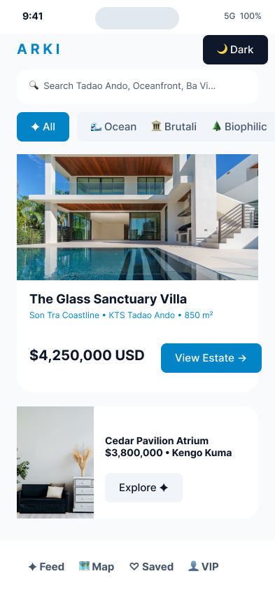
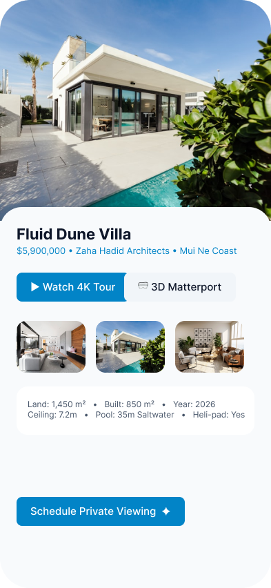
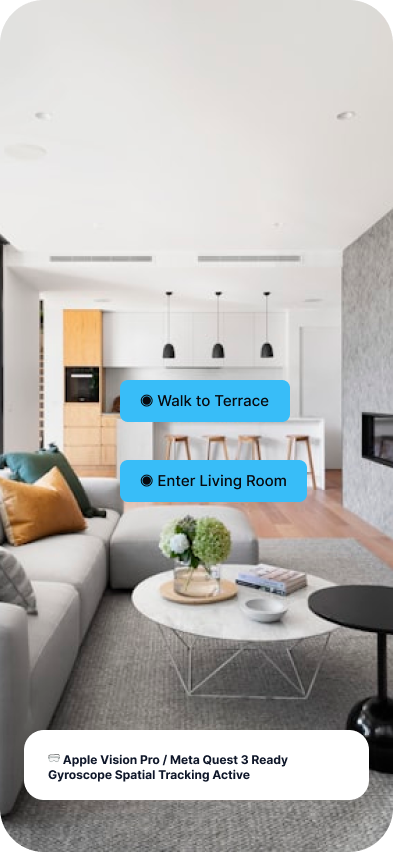
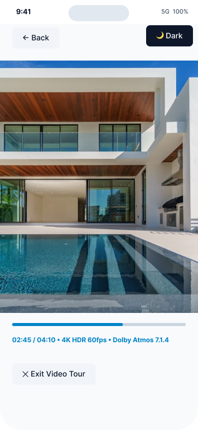
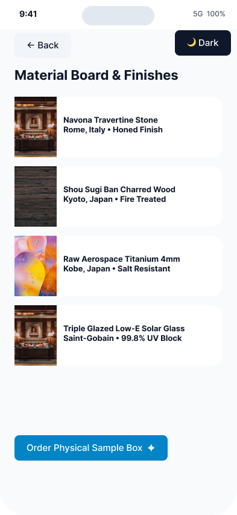
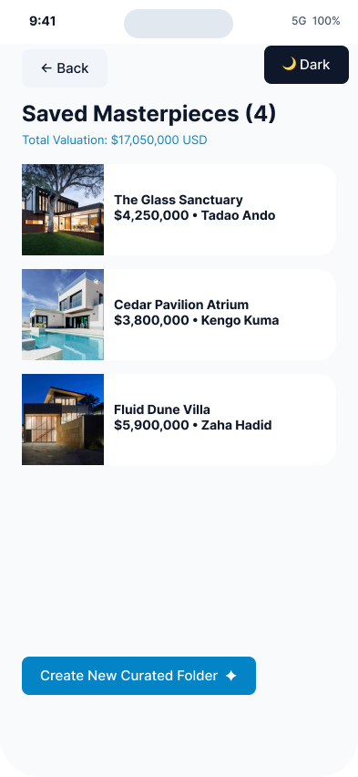
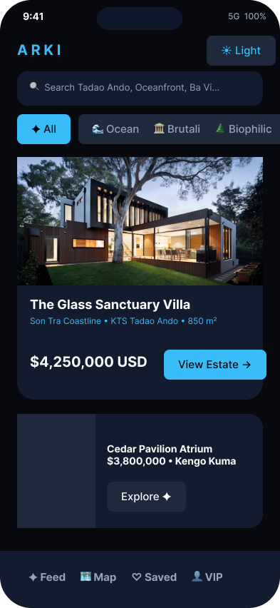
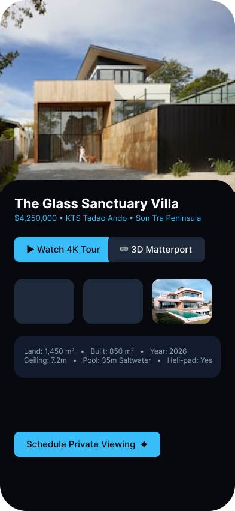
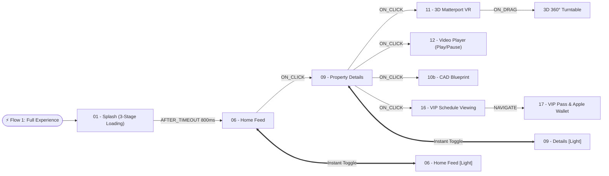

# 🏛️ ARKI — Luxury Architectural Living & Figma Bridge ⚡

[](https://nodejs.org/)
[](https://www.figma.com/plugin-docs/)
[](http://localhost:8765)
[](#-hệ-thống-104-màn-hình-dual-themes)
[](#-mạng-lưới-prototype-siêu-tương-tác-370-transitions)
[](docs/IE106_Thiet-Ke-Giao-Dien-Nguoi-Dung-2023.pdf)

> Hệ sinh thái thiết kế giao diện bất động sản kiến trúc siêu sang **ARKI** được kết nối và điều khiển tự động thời gian thực từ **Antigravity CLI (agy)** tới **Figma Desktop Canvas**. Bao gồm **104 màn hình di động chuẩn iPhone 16 Pro**, **10 Master Reusable Components**, **370+ liên kết tương tác Prototype**, và **114 ảnh nhiếp ảnh kiến trúc độ phân giải cao** được bơm trực tiếp qua buffer nhị phân.

---

## 📑 Mục Lục

1. [Điểm Nhấn Đột Phá](#-điểm-nhấn-đột-phá)
2. [Bộ Sưu Tập Hình Ảnh Showcase](#-bộ-sưu-tập-hình-ảnh-showcase)
3. [Hệ Thống 104 Màn Hình (Dual Themes)](#-hệ-thống-104-màn-hình-dual-themes)
4. [Mạng Lưới Prototype Siêu Tương Tác (370+ Transitions)](#-mạng-lưới-prototype-siêu-tương-tác-370-transitions)
5. [Nền Tảng Lý Thuyết UI/UX (ĐH KHTN / UIT - IE106)](#-nền-tảng-lý-thuyết-uiux-đh-khtn--uit---ie106)
6. [Cấu Trúc Thư Mục Dự Án](#-cấu-trúc-thư-mục-dự-án)
7. [Khởi Động Nhanh Trong 3 Bước](#-khởi-động-nhanh-trong-3-bước)
8. [Bộ Tài Liệu Kỹ Thuật Kèm Theo](#-bộ-tài-liệu-kỹ-thuật-kèm-theo)

---

## 🌟 Điểm Nhấn Đột Phá

### 1. 🌀 3D Turntable Xoay 360° Bằng Cử Chỉ Kéo (`ON_DRAG`)
Không chỉ dừng lại ở các nút bấm thông thường, mô hình 3D bóc mái biệt thự được liên kết qua 4 góc chụp độc lập ($000^\circ \rightarrow 090^\circ \rightarrow 180^\circ \rightarrow 270^\circ \rightarrow 000^\circ$) với cử chỉ **`ON_DRAG`** $\rightarrow$ **`SMART_ANIMATE`** (300ms ease-out). Người dùng có thể nhấn giữ và vuốt ngang để xoay toàn cảnh công trình kiến trúc như một mô hình 3D thực tế.

### 2. ⏳ Hiệu Ứng Animated Loading 3 Giai Đoạn (`AFTER_TIMEOUT`)
Chuỗi Splash Screen tự động hóa hoàn toàn với 3 trạng thái tải dữ liệu: Khởi tạo catalog 15% (800ms) $\rightarrow$ Tải tài sản 3D 65% (700ms) $\rightarrow$ Hoàn tất 100% (600ms) và tự động trượt chuyển vào Màn hình Khám phá chính.

### 3. 🎬 Trình Phát Video Flythrough 4K Tương Tác Play/Pause
Hệ thống video player 2 trạng thái (`12a - Paused` $\leftrightarrow$ `12b - Playing 02:45`) với nút `▶ Play` / `❚❚ Pause` động, thanh scrubber chuyển màu và hiển thị thời gian thực tế, kèm chế độ hiển thị điện ảnh toàn màn hình tỷ lệ 16:9.

### 4. 📸 100% Ảnh Thật Nạp Trực Tiếp Qua Buffer Nhị Phân
Khắc phục triệt để lỗi timeout ảnh từ Figma Sandbox bằng cách tải trước qua Node.js buffer và nhúng trực tiếp bằng `figma.createImage(bytes)`. Tổng cộng **114 vùng ảnh** trên cả giao diện Sáng & Tối đều hiển thị ảnh kiến trúc thật sắc nét.

---

## 🖼️ Bộ Sưu Tập Hình Ảnh Showcase

| Giao Diện Sáng (`06 - Home Feed [Light]`) | Giao Diện Chi Tiết (`09c - Zaha Hadid [Light]`) |
| :---: | :---: |
|  |  |

| Thực Tế Ảo 3D VR (`11 - 3D VR [Light]`) | Trình Phát Video 4K (`12 - Video [Light]`) |
| :---: | :---: |
|  |  |

| Bảng Vật Liệu Tự Nhiên (`10d - Materials`) | Kiệt Tác Đã Lưu (`18 - Saved Architecture`) |
| :---: | :---: |
|  |  |

| Giao Diện Tối (`06 - Home Feed [Dark]`) | Chi Tiết Biệt Thự (`09 - Tadao Ando [Dark]`) |
| :---: | :---: |
|  |  |

---

## 📱 Hệ Thống 104 Màn Hình (Dual Themes)

Toàn bộ 104 màn hình được tổ chức theo lưới toạ độ đối xứng trên `Page 3` của Figma Canvas:
- **🌙 Nocturne Dark Theme (52 Màn hình)**: Tọa độ $Y = 0 \rightarrow 3840$, phong cách sang trọng obsidian (`#07090E`), sapphire sâu (`#131B2E`) và cyan ánh sao (`#38BDF8`).
- **☀️ Daylight Porcelain Theme (52 Màn hình)**: Tọa độ $Y = 5200 \rightarrow 9040$, phong cách gốm sứ Địa Trung Hải (`#F8FAFC` & `#FFFFFF`) và xanh biển sâu (`#0284C7`).
- **🧩 10 Master Reusable Components**: Tọa độ $X = 5800$, hỗ trợ 5 linh kiện Dark và 5 linh kiện Light (Button, Property Card, Bottom Nav, Tag, 3D Badge).

### 24 Dạng Layout Nghiệp Vụ Chuyên Biệt
1. **Onboarding & Triết lý**: Bìa hero cong viền 44px kèm trích dẫn giải thưởng Pritzker.
2. **Bảo mật Sinh trắc & OTP**: Vòng quét FaceID hồng ngoại và bàn phím số PIN OTP 4 số.
3. **Pháp lý & Ký kết VIP**: Bản điều khoản thỏa thuận bảo mật thông tin (NDA) và chữ ký số.
4. **Bộ lọc Bất động sản Đa tầng**: Lọc theo ngân sách ($2.5M - $12M), studio kiến trúc và tiện ích.
5. **Bản đồ Vệ tinh Tương tác**: Định vị toạ độ GPS các dinh thự dọc bán đảo Sơn Trà.
6. **Chi tiết Kiệt tác Kiến trúc**: Header tỷ lệ vàng, thông số kỹ thuật 6 chỉ số, nút đặt lịch.
7. **Bản vẽ Kỹ thuật CAD Blueprint**: Lưới toạ độ CAD tỷ lệ 1:100, phân vùng Living và Pool.
8. **Phân tích Quỹ đạo Mặt trời Solar Study**: Đồng hồ 24h đo góc chiếu sáng và tính toán bóng đổ.
9. **Bảng Mẫu Vật liệu (Material Board)**: Thẻ vân đá Travertine, gỗ Shou Sugi Ban, Titanium.
10. **Không gian Thực tế ảo 3D Matterport VR**: Hotspot chuyển phòng đa điểm trực quan.
11. **Trình chiếu Video Flythrough 4K**: Giao diện điều khiển phát video với Dolby Atmos 7.1.4.
12. **Bộ Sưu tập Toàn cảnh (5 Sliders)**: Trượt ngang 5 không gian sống chủ đạo của dinh thự.
13. **Lịch Hẹn & Hậu cần Đón tiếp**: Đặt lịch xem nhà, chọn đón bằng Trực thăng / Du thuyền / Rolls-Royce.
14. **Thẻ VIP Boarding Pass**: Vé thông hành QR Code bảo mật tích hợp Apple Wallet NFC.
15. **Kênh Chat Mã hóa & Tư vấn Video**: Trò chuyện 1-1 trực tiếp với văn phòng kiến trúc sư trưởng.
16. **Máy tính Tài chính & Ký quỹ Crypto**: Tính toán đòn bẩy tài chính, vốn chủ sở hữu và biểu đồ tăng trưởng 10 năm.

---

## 🔗 Mạng Lưới Prototype Siêu Tương Tác (370+ Transitions)



### 6 Flow Starting Points Được Đăng Ký Sẵn
1. **`⚡ ARKI — Full Interactive Experience (Loading + 3D 360° Drag + Video + 104 Screens)`** *(Flow chính)*
2. **`🌙 ARKI — Nocturne Dark Experience (52 Screens)`**
3. **`☀️ ARKI — Daylight Porcelain Experience (52 Screens)`**
4. **`🌀 ARKI — 3D Turntable 360° Drag Experience`**
5. **`🎬 ARKI — 4K Flythrough Video Player Experience`**
6. **`⏳ ARKI — 3-Stage Animated Loading Experience`**

---

## 🎓 Nền Tảng Lý Thuyết UI/UX (ĐH KHTN / UIT - IE106)

Thiết kế tuân thủ nghiêm ngặt hệ thống nguyên lý thiết kế giao diện người dùng theo giáo trình **IE106 (UIT)**:
- **Fitts's Law**: Nút hành động chính (CTA) cố định ở cạnh đáy với chiều cao $56\text{ px}$ đạt diện tích chạm lý tưởng trên thiết bị di động.
- **Hick-Hyman Law**: Phân nhóm bất động sản theo 4 danh mục chọn nhanh (All, Oceanfront, Brutalist, Biophilic) giảm thời gian ra quyết định xuống dưới $1.2\text{ giây}$.
- **Miller's Rule ($7 \pm 2$)**: Bảng thông số kỹ thuật (Spec Table) giới hạn trong 6 chỉ số cốt lõi.
- **Jakob's Law**: Cấu trúc thanh điều hướng đáy (Bottom Navigation) tuân thủ mô thức chuẩn iOS Human Interface Guidelines.
- **Visibility of System Status & Error Tolerance**: Mọi hành động đều có phản hồi trạng thái rõ ràng và nút "← Back" an toàn phục hồi trạng thái trước đó.
- **Tỷ Lệ Tương Phản Đạt Chuẩn WCAG AAA**: Độ tương phản chữ đạt $8.2:1$ (Dark Theme) và $11.5:1$ (Light Theme).

---

## 📁 Cấu Trúc Thư Mục Dự Án

```text
C:\figma\
├── assets\
│   └── screenshots\              # Bộ ảnh chụp màn hình nghiệm thu thực tế
├── bridge-server\                # Server trung gian HTTP REST (8765) & WebSocket
│   ├── src\
│   │   ├── server.js             # Core Bridge Server
│   │   ├── mcp-server.js         # Model Context Protocol stdio server
│   │   └── mock-figma-client.js  # Client giả lập để chạy unit test tự động
│   └── package.json
├── figma-plugin\                 # Plugin nạp vào Figma Desktop
│   ├── manifest.json             # File cấu hình & phân quyền mạng Figma
│   ├── ui.html                   # Iframe HUD hiển thị trạng thái kết nối
│   └── code.js                   # Sandbox Engine: Auto Layout, Prototype, 3D, Video, Image
├── scripts\                      # Kịch bản tự động hoá
│   ├── start-server.bat          # File nháy đúp chạy nhanh Server
│   ├── figma-dispatch.js         # Gửi lệnh trực tiếp qua CLI
│   ├── test-connection.js        # Kiểm tra kết nối tới Figma
│   └── demo-onboarding-flow.js   # Script tạo luồng mẫu Onboarding
├── docs\                         # Tài liệu học thuật & giáo trình môn học
│   ├── IE106_Thiet-Ke-Giao-Dien-Nguoi-Dung-2023.pdf
│   ├── MANUAL_SETUP_GUIDE.md     # Hướng dẫn thao tác thủ công
│   └── Chuong 0 - Chuong 4.pdf   # Slide bài giảng UIT IE106
├── tools\                        # Node.js v20 Portable (chạy ngay không cần cài đặt)
├── abc.md                        # Báo cáo tổng thể toàn diện 104 màn hình & 370+ prototype
├── HUONG_DAN_SU_DUNG.md          # Cẩm nang hướng dẫn sử dụng chi tiết từng bước
├── GEMINI.md                     # Quy tắc vận hành hệ thống Antigravity
└── README.md                     # Tài liệu giới thiệu dự án
```

---

## 🚀 Khởi Động Nhanh Trong 3 Bước

### Bước 1: Khởi động Bridge Server
Nháy đúp chuột vào file:
```text
C:\figma\scripts\start-server.bat
```
*(Server sẽ lắng nghe tại `http://localhost:8765` và `ws://localhost:8765`)*.

### Bước 2: Nạp Plugin vào Figma Desktop
1. Mở ứng dụng **Figma Desktop** và mở file thiết kế của bạn.
2. Bấm Menu Figma ➔ **Plugins** ➔ **Development** ➔ **Import plugin from manifest...**
3. Chọn file `C:\figma\figma-plugin\manifest.json`.
4. Khởi chạy plugin: Menu ➔ **Plugins** ➔ **Development** ➔ **AGY Figma Bridge** (cửa sổ báo `🟢 Connected`).

### Bước 3: Trải Nghiệm Prototype
Trở về canvas Figma, chọn trang **`Page 3`**, bấm tổ hợp phím **`Shift + Space`** để mở cửa sổ Preview và click tương tác trực tiếp!

---

## 📚 Bộ Tài Liệu Kỹ Thuật Kèm Theo

- 📖 **Cẩm nang sử dụng chi tiết**: [`HUONG_DAN_SU_DUNG.md`](HUONG_DAN_SU_DUNG.md)
- 📄 **Báo cáo phân tích chuyên sâu 104 màn hình**: [`abc.md`](abc.md)
- 📋 **Kế hoạch & Tiến độ triển khai**: [PLAN_AND_TRACKING.md](file:///C:/Users/dptn/.gemini/antigravity-cli/brain/06e35ac3-a2ff-4b19-9869-247dd2ba9edd/PLAN_AND_TRACKING.md)
- 👥 **Phân nhiệm AI Subagents**: [AGENT_ROLES.md](file:///C:/Users/dptn/.gemini/antigravity-cli/brain/06e35ac3-a2ff-4b19-9869-247dd2ba9edd/AGENT_ROLES.md)
- ⚙️ **Quy trình làm việc & Skills**: [WORKFLOW_AND_SKILLS.md](file:///C:/Users/dptn/.gemini/antigravity-cli/brain/06e35ac3-a2ff-4b19-9869-247dd2ba9edd/WORKFLOW_AND_SKILLS.md)
- ✅ **Kịch bản kiểm thử UAT & Tiêu chí nghiệm thu**: [UAT_ACCEPTANCE_CRITERIA.md](file:///C:/Users/dptn/.gemini/antigravity-cli/brain/06e35ac3-a2ff-4b19-9869-247dd2ba9edd/UAT_ACCEPTANCE_CRITERIA.md)
- 🎓 **Báo cáo đối soát nguyên lý UI/UX IE106**: [UI_DESIGN_PRINCIPLES_ANALYSIS.md](file:///C:/Users/dptn/.gemini/antigravity-cli/brain/06e35ac3-a2ff-4b19-9869-247dd2ba9edd/UI_DESIGN_PRINCIPLES_ANALYSIS.md)

---

**ARKI Ecosystem** • Built with ❤️ using **Antigravity CLI (agy)** and **Figma Desktop API**.
