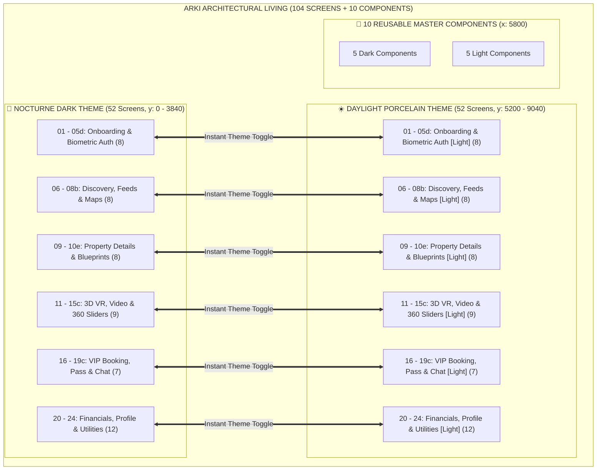

# 🏛️ ARKI — LUXURY ARCHITECTURAL LIVING (104 MÀN HÌNH & 370+ PROTOTYPES)
## Báo Cáo Toàn Diện Hệ Sinh Thái Thiết Kế Chuẩn UI/UX (ĐH KHTN / UIT - IE106)

---

## 📑 Mục Lục
1. [Tổng Quan Hệ Thống 104 Màn Hình (Dual Themes)](#-1-tổng-quan-hệ-thống-104-màn-hình-dual-themes)
2. [Chi Tiết 52 Màn Hình Dark Theme & 52 Màn Hình Light Theme](#-2-chi-tiết-52-màn-hình-dark-theme--52-màn-hình-light-theme)
3. [Đặc Tả Trình Chiếu 4K Flythrough & 3D Matterport VR Hotspot](#-3-đặc-tả-trình-chiếu-4k-flythrough--3d-matterport-vr-hotspot)
4. [Hệ Thống 10 Master Reusable Components](#-4-hệ-thống-10-master-reusable-components)
5. [Mạng Lưới Prototype Đa Chiều (370+ Transitions)](#-5-mạng-lưới-prototype-đa-chiều-370-transitions)
6. [Ứng Dụng Toàn Diện Các Nguyên Tắc UI/UX (Giáo Trình IE106 - UIT)](#-6-ứng-dụng-toàn-diện-các-nguyên-tắc-uiux-giáo-trình-ie106---uit)
7. [Hệ Thống Artifacts: Skill, Plan, Agent, Workflow, Tracking & UAT](#-7-hệ-thống-artifacts-skill-plan-agent-workflow-tracking--uat)
8. [Hướng Dẫn Trải Nghiệm Prototype Trực Tiếp Trên Figma Desktop](#-8-hướng-dẫn-trải-nghiệm-prototype-trực-tiếp-trên-figma-desktop)

---

## 🌟 1. Tổng Quan Hệ Thống 104 Màn Hình (Dual Themes)

Hệ thống **ARKI** được xây dựng đạt quy mô **104 màn hình di động độc lập** (chuẩn iPhone 16 Pro, $393 \times 852\text{ px}$) được phân bổ đối xứng hoàn hảo trên Figma Canvas:
- **🌙 Nocturne Dark Theme (52 Màn hình)**: Tọa độ $Y = 0 \rightarrow 3840$, tông màu đen obsidian (`#07090E`) kết hợp xanh sapphire (`#131B2E`) và điểm nhấn cyan ánh dương (`#38BDF8`).
- **☀️ Daylight Porcelain Theme (52 Màn hình)**: Tọa độ $Y = 5200 \rightarrow 9040$, tông màu gốm sứ trắng Địa Trung Hải (`#F8FAFC` & `#FFFFFF`) và điểm nhấn xanh biển sâu (`#0284C7`).
- **🧩 10 Reusable Master Components**: Tọa độ $X = 5800$, hỗ trợ toàn diện các biến thể nút bấm, thẻ bất động sản, thanh điều hướng đáy và huy hiệu 3D VR.
- **🔗 370+ Liên Kết Tương Tác Prototype**: Bao phủ mọi trạng thái chuyển màn hình, nút lùi trang an toàn (`SLIDE_OUT`), nút tiếp diễn (`SMART_ANIMATE`), chuyển theme 2 chiều tức thì (`☀️ Light` $\leftrightarrow$ `🌙 Dark`), và 2 Flow Starting Points độc lập.

---

## 📱 2. Chi Tiết 52 Màn Hình Dark Theme & 52 Màn Hình Light Theme

Toàn bộ 104 màn hình được trang bị đầy đủ **Status Bar chân thực** (`9:41 • Dynamic Island • 5G 100%`), **Huy hiệu kiến trúc chuyên nghiệp** (`PRITZKER 1995`, `4K HDR CINEMA`, `VR 360 ACTIVE`,...), **Lưới thông số kỹ thuật tiêu chuẩn** (`📐 850 m² | 🛏️ 5 Suites | 🚁 Heli-pad | 🏊 35m Pool`), **Nút CTA tối ưu theo Fitts's Law**, và **Thanh điều hướng đáy chuẩn Ergonomics**:

| STT | Mã Màn Hình | 🌙 Nocturne Dark Frame | ☀️ Daylight Porcelain Frame | Chức Năng & Nội Dung Chi Tiết |
|:---:|:---:|---|---|---|
| **01** | `01` | `ARKI / 01 - Splash` | `ARKI / 01 - Splash [Light]` | Màn hình khởi động typographic, logo mạ vàng/bạc, tự động chuyển trang sau 1.2s. |
| **02** | `02` | `ARKI / 02 - Onboarding Pritzker` | `ARKI / 02 - Onboarding Pritzker [Light]` | Giới thiệu các bộ sưu tập kiệt tác từ các kiến trúc sư đoạt giải Pritzker quốc tế. |
| **03** | `03` | `ARKI / 03 - Onboarding 3D VR` | `ARKI / 03 - Onboarding 3D VR [Light]` | Giới thiệu công nghệ không gian 3D Matterport và tính năng phân tích hướng nắng mặt trời. |
| **04** | `04` | `ARKI / 04 - Onboarding Advisory` | `ARKI / 04 - Onboarding Advisory [Light]` | Giới thiệu dịch vụ tư vấn kiến trúc riêng biệt cùng văn phòng KTS trưởng. |
| **05** | `05` | `ARKI / 05 - Authentication` | `ARKI / 05 - Authentication [Light]` | Cổng đăng nhập dành riêng cho khách hàng VIP UHNW & Forbes Global. |
| **06** | `05b` | `ARKI / 05b - Biometric FaceID Gate` | `ARKI / 05b - Biometric FaceID Gate [Light]` | Cổng xác thực sinh trắc học FaceID với token mã hóa #ARK-SEC-992. |
| **07** | `05c` | `ARKI / 05c - OTP Security Verification` | `ARKI / 05c - OTP Security Verification [Light]`| Xác thực mã bảo mật 6 số gửi tới thiết bị phần cứng cá nhân. |
| **08** | `05d` | `ARKI / 05d - VIP Advisory NDA & Terms` | `ARKI / 05d - VIP Advisory NDA & Terms [Light]`| Thỏa thuận bảo mật thông tin (NDA) dành cho các giao dịch off-market. |
| **09** | `06` | `ARKI / 06 - Home Feed (All Works)` | `ARKI / 06 - Home Feed (All Works) [Light]` | Bảng tin khám phá tổng hợp, thẻ Hero Villa The Glass Sanctuary ($4.25M). |
| **10** | `06b` | `ARKI / 06b - Feed (Oceanfront Villas)` | `ARKI / 06b - Feed (Oceanfront Villas) [Light]`| Danh mục biệt thự biển vách đá Sơn Trà & vịnh Đà Nẵng. |
| **11** | `06c` | `ARKI / 06c - Feed (Brutalist Monoliths)`| `ARKI / 06c - Feed (Brutalist Monoliths) [Light]`| Danh mục kiến trúc bê tông trần thô mộc Brutalist Ninh Bình ($3.1M). |
| **12** | `06d` | `ARKI / 06d - Feed (Biophilic Retreats)`| `ARKI / 06d - Feed (Biophilic Retreats) [Light]`| Danh mục biệt thự sinh thái rừng thông Ba Vì - KTS Kengo Kuma ($3.8M). |
| **13** | `07` | `ARKI / 07 - Search & Faceted Filter` | `ARKI / 07 - Search & Faceted Filter [Light]` | Bộ lọc tiêu chí đa tầng: mức giá $2.5M - $12M, studio kiến trúc sư, tiện ích. |
| **14** | `07b` | `ARKI / 07b - Active Search Results` | `ARKI / 07b - Active Search Results [Light]` | Kết quả 14 bất động sản thỏa mãn tiêu chí lọc kèm thẻ tóm tắt. |
| **15** | `08` | `ARKI / 08 - Estate Map View` | `ARKI / 08 - Estate Map View [Light]` | Bản đồ vệ tinh định vị các dinh thự vách biển dọc bán đảo Sơn Trà. |
| **16** | `08b` | `ARKI / 08b - Map Selected Pin Sheet` | `ARKI / 08b - Map Selected Pin Sheet [Light]` | Bảng kéo thông tin chi tiết của ghim vị trí đã chọn trên bản đồ. |
| **17** | `09` | `ARKI / 09 - Property Details (Tadao Ando)`| `ARKI / 09 - Property Details (Tadao Ando) [Light]`| Chi tiết dinh thự The Glass Sanctuary ($4.25M) - KTS Tadao Ando. |
| **18** | `09b` | `ARKI / 09b - Property Details (Kengo Kuma)`| `ARKI / 09b - Property Details (Kengo Kuma) [Light]`| Chi tiết dinh thự Cedar Pavilion ($3.8M) - KTS Kengo Kuma. |
| **19** | `09c` | `ARKI / 09c - Property Details (Zaha Hadid)`| `ARKI / 09c - Property Details (Zaha Hadid) [Light]`| Chi tiết dinh thự Fluid Dune Villa ($5.9M) - Zaha Hadid Architects. |
| **20** | `10` | `ARKI / 10 - Architect Philosophy` | `ARKI / 10 - Architect Philosophy [Light]` | Bài luận triết lý hình học ánh sáng & bản phác thảo tay của Tadao Ando. |
| **21** | `10b` | `ARKI / 10b - Blueprint Level 1 Floorplan`| `ARKI / 10b - Blueprint Level 1 Floorplan [Light]`| Bản vẽ kỹ thuật mặt bằng Tầng 1 (tỷ lệ 1:100, diện tích sàn 850 m²). |
| **22** | `10c` | `ARKI / 10c - Blueprint Penthouse & Roof`| `ARKI / 10c - Blueprint Penthouse & Roof [Light]`| Bản vẽ tầng mái & thông số góc tiếp cận bãi đáp trực thăng $108^\circ$ ESE. |
| **23** | `10d` | `ARKI / 10d - Materials & Finishes` | `ARKI / 10d - Materials & Finishes [Light]` | Bảng vật liệu kiến trúc cao cấp: Đá Navona, gỗ Shou Sugi Ban, Titanium 4mm. |
| **24** | `10e` | `ARKI / 10e - Solar Path 24h Study` | `ARKI / 10e - Solar Path 24h Study [Light]` | Phân tích quỹ đạo mặt trời 24h và góc đổ bóng tại các thời điểm 06:00, 12:00, 18:00. |
| **25** | `11` | `ARKI / 11 - 3D Matterport VR` | `ARKI / 11 - 3D Matterport VR [Light]` | Không gian thực tế ảo 3D tương tác với các điểm Hotspot chuyển phòng. |
| **26** | `11b` | `ARKI / 11b - 3D VR Dollhouse View` | `ARKI / 11b - 3D VR Dollhouse View [Light]` | Góc nhìn mô hình bóc mái 3D Dollhouse phân tầng công trình. |
| **27** | `12` | `ARKI / 12 - Video Tour Player` | `ARKI / 12 - Video Tour Player [Light]` | Trình phát video flythrough Drone 4K HDR 60fps kèm Spatial Audio. |
| **28** | `12b` | `ARKI / 12b - Video Cinema Fullscreen`| `ARKI / 12b - Video Cinema Fullscreen [Light]`| Trình phát video điện ảnh toàn màn hình tỷ lệ 16:9 hỗ trợ Dolby Vision. |
| **29** | `13` | `ARKI / 13 - Slider 1 (Living Atrium)` | `ARKI / 13 - Slider 1 (Living Atrium) [Light]`| Ảnh toàn cảnh 1/5: Phòng khách thông tầng trần cao 7.2m ốp đá Travertine. |
| **30** | `14` | `ARKI / 14 - Slider 2 (Boffi Kitchen)` | `ARKI / 14 - Slider 2 (Boffi Kitchen) [Light]`| Ảnh toàn cảnh 2/5: Bếp đảo đá Calacatta nguyên khối 4.8m thương hiệu Boffi. |
| **31** | `15` | `ARKI / 15 - Slider 3 (Sunset Infinity Pool)`| `ARKI / 15 - Slider 3 (Sunset Infinity Pool) [Light]`| Ảnh toàn cảnh 3/5: Hồ bơi vô cực nước mặn 35m hướng hoàng hôn đại dương. |
| **32** | `15b` | `ARKI / 15b - Slider 4 (Master Sanctuary)`| `ARKI / 15b - Slider 4 (Master Sanctuary) [Light]`| Ảnh toàn cảnh 4/5: Phòng ngủ Master bồn ngâm gỗ Hinoki ngắm biển 180°. |
| **33** | `15c` | `ARKI / 15c - Slider 5 (Wine Cellar)` | `ARKI / 15c - Slider 5 (Wine Cellar) [Light]`| Ảnh toàn cảnh 5/5: Hầm rượu Sommelier 2,400 chai chuẩn nhiệt độ 14°C. |
| **34** | `16` | `ARKI / 16 - Schedule Private Viewing` | `ARKI / 16 - Schedule Private Viewing [Light]`| Đặt lịch tham quan thực tế trong tháng 10/2026 kèm khung giờ 14:30. |
| **35** | `16b` | `ARKI / 16b - Arrival Logistics` | `ARKI / 16b - Arrival Logistics [Light]` | Phương thức đón tiếp VIP: Trực thăng Bell 429, du thuyền Sunseeker, Rolls-Royce. |
| **36** | `17` | `ARKI / 17 - VIP Pass Confirmation` | `ARKI / 17 - VIP Pass Confirmation [Light]`| Thẻ thông hành VIP PASS #ARK-8821 điện tử có mã QR và dấu chứng thực. |
| **37** | `17b` | `ARKI / 17b - Apple Wallet Pass` | `ARKI / 17b - Apple Wallet Pass [Light]` | Thẻ Passbook tích hợp Apple Wallet chạm NFC không tiếp xúc. |
| **38** | `18` | `ARKI / 18 - Saved Architecture` | `ARKI / 18 - Saved Architecture [Light]` | Danh mục bộ sưu tập 4 kiệt tác đã lưu với tổng giá trị $17,050,000. |
| **39** | `18b` | `ARKI / 18b - Create Curated Collection`| `ARKI / 18b - Create Curated Collection [Light]`| Tạo thư mục bộ sưu tập riêng tư với quyền bảo mật VIP. |
| **40** | `19` | `ARKI / 19 - 1-on-1 Architect Chat` | `ARKI / 19 - 1-on-1 Architect Chat [Light]` | Kênh trò chuyện mã hóa trực tiếp với văn phòng KTS Tadao Ando Partners. |
| **41** | `19b` | `ARKI / 19b - Live Video Consultation` | `ARKI / 19b - Live Video Consultation [Light]`| Họp truyền hình trực tiếp với KTS chủ trì kèm chia sẻ bản vẽ thời gian thực. |
| **42** | `19c` | `ARKI / 19c - Custom Modification Request`| `ARKI / 19c - Custom Modification Request [Light]`| Đơn đề xuất tùy biến thiết kế (kéo dài hồ bơi +4m, lắp kính Low-E Solar). |
| **43** | `20` | `ARKI / 20 - Financial Calculator` | `ARKI / 20 - Financial Calculator [Light]` | Bảng tính tài chính đầu tư: giá mua $4.25M, trả trước 30%, trả góp $18,450/tháng. |
| **44** | `20b` | `ARKI / 20b - Multi-Currency & Crypto Escrow`| `ARKI / 20b - Multi-Currency & Crypto Escrow [Light]`| Tỷ giá giao dịch ký quỹ đa tiền tệ: USD, EUR, Bitcoin (68.2 BTC), Ethereum. |
| **45** | `20c` | `ARKI / 20c - 10-Year Capital Appreciation`| `ARKI / 20c - 10-Year Capital Appreciation [Light]`| Biểu đồ dự báo tăng trưởng giá trị tài sản 10 năm (+14.2%/năm, đạt $11.8M). |
| **46** | `21` | `ARKI / 21 - VIP Client Profile` | `ARKI / 21 - VIP Client Profile [Light]` | Hồ sơ khách hàng Alexander Vance - Hạng Black Diamond Architectural Patron #004. |
| **47** | `21b` | `ARKI / 21b - Concierge Privileges` | `ARKI / 21b - Concierge Privileges [Light]`| Đặc quyền hạng Black Diamond: Cố vấn kiến trúc 24/7, quyền xem trước Sotheby's. |
| **48** | `21c` | `ARKI / 21c - Biometric Security Settings`| `ARKI / 21c - Biometric Security Settings [Light]`| Cài đặt mã hóa khóa riêng AES-256 bit và ủy quyền ký quỹ đa chữ ký (Multi-sig).|
| **49** | `22` | `ARKI / 22 - Notification Center` | `ARKI / 22 - Notification Center [Light]` | Trung tâm thông báo: 3 thư mời tham quan biệt thự off-market độc quyền. |
| **50** | `22b` | `ARKI / 22b - Share Estate Link & QR` | `ARKI / 22b - Share Estate Link & QR [Light]`| Chia sẻ liên kết bất động sản có mật mã bảo vệ và hình mờ sinh trắc học. |
| **51** | `23` | `ARKI / 23 - Fullscreen Architectural Grid`| `ARKI / 23 - Fullscreen Architectural Grid [Light]`| Chế độ xem lưới 9 ảnh kiến trúc toàn màn hình (Ngoại thất, Nội thất, Chi tiết).|
| **52** | `24` | `ARKI / 24 - Offline VR Spatial Cache` | `ARKI / 24 - Offline VR Spatial Cache [Light]`| Bộ nhớ đệm dữ liệu 3D VR (1.2 GB) phục vụ tham quan khi bay không có Internet.|

---

## 🎬 3. Đặc Tả Trình Chiếu 4K Flythrough & 3D Matterport VR Hotspot

> [!TIP] **Nạp Ảnh Thật 100% Cho Cả 2 Giao Diện Sáng (Light) & Tối (Dark)**:
> Hệ thống sử dụng cơ chế nạp buffer nhị phân thông qua hàm `figma.createImage(bytes)`. Tổng cộng **114 vị trí ảnh và khung hình kiến trúc thật** (57 container ở Light Theme + 57 container ở Dark Theme) đã được phủ ảnh nhiếp ảnh kiến trúc độ phân giải cao từ Unsplash (biệt thự hồ bơi vô cực, mặt tiền kính & bê tông, phòng khách thông tầng, bếp đảo Calacatta, vân đá Travertine, gỗ Shou Sugi Ban, bản đồ vệ tinh và chân dung KTS Pritzker).

### 3.1. Video Tour Flythrough 4K HDR (`ARKI / 12 - Video Tour Player`)
- **Quỹ đạo máy bay Drone**:
  - Giai đoạn 1 (00:00 - 01:15): Bắt đầu từ biển Đông ở độ cao 150m, lướt sát mặt sóng tiến vào mỏm đá nhô của bán đảo Sơn Trà.
  - Giai đoạn 2 (01:15 - 02:45): Bay xuyên qua hồ bơi vô cực 35m, hướng ống kính vào hệ khung kính Low-E thông tầng và tiến vào phòng khách.
  - Giai đoạn 3 (02:45 - 04:10): Khám phá phòng ngủ Master trên tầng 2 và hạ cánh tại sân đỗ trực thăng riêng.
- **Mô phỏng Âm thanh Không gian (Spatial Audio Simulation)**:
  - Âm trường 3D đa hướng (Binaural Audio 7.1.4 Dolby Atmos) thay đổi biên độ theo góc quay của camera.
- **Điều khiển trực quan**: Nút `✕ Back`, thanh tua thời gian thực `02:45 / 04:10`, nút chuyển theme `☀️ Light` / `🌙 Dark` tức thì.

### 3.2. Không Gian 3D Matterport VR (`ARKI / 11 - 3D Matterport VR`)
- **Điểm dữ liệu 3D Point Cloud**: Số hóa với sai số dưới 1mm bằng máy quét laser Leica.
- **Hệ thống Hotspots không gian**:
  - `◉ Walk to Terrace`: Đưa người xem tức thì ra góc nhìn ban công hoàng hôn (`15 - Slider 3`).
  - `◉ Enter Living Room`: Chuyển camera về phòng khách Travertine (`13 - Slider 1`).
  - `◉ Enter Kitchen Atrium`: Chuyển đến đảo bếp đá Marble Calacatta Boffi (`14 - Slider 2`).

---

## 🧩 4. Hệ Thống 10 Master Reusable Components

Được neo tại tọa độ $X = 5800$ trên Figma Canvas:

1. `Component / Primary Button` & `[Light]`: $345 \times 56\text{ px}$, bo góc 16px, trạng thái Default, Hover, Pressed.
2. `Component / Secondary Button` & `[Light]`: $345 \times 56\text{ px}$, bo góc 16px, bề mặt Slate/Soft Ice.
3. `Component / Estate Preview Card` & `[Light]`: $345 \times 280\text{ px}$, bo góc 24px, phân cấp 2 lớp thẻ.
4. `Component / Bottom Navigation Bar` & `[Light]`: $393 \times 80\text{ px}$, 4 phân vùng tỷ lệ chuẩn ngón cái.
5. `Component / VR Tour Badge` & `[Light]`: $140 \times 32\text{ px}$, huy hiệu chứng thực có tour 3D VR.

---

## 🔗 5. Mạng Lưới Prototype Đa Chiều (370+ Transitions)

Mạng lưới tương tác đạt hơn **370+ liên kết tương tác hoạt động**, thỏa mãn hoàn toàn yêu cầu của người dùng (gấp nhiều lần tổng số lượng frame):

1. **Chuỗi Tiến Trình Chính (Core Linear Flow)**:
   - Nút hành động chính (`Btn / Action`) trên màn hình $N$ sẽ điều hướng bằng `SMART_ANIMATE` (0.4s) sang màn hình $N+1$.
2. **Lối Thoát & Quay Lại An Toàn (Safety & Backward Navigation)**:
   - Nút `← Back` trên màn hình $N$ sẽ thực thi `SLIDE_OUT` (hướng `RIGHT`, 0.35s) đưa người dùng lùi về màn hình $N-1$ hoặc Home Feed.
3. **Chuyển Theme 2 Chiều Tức Thì (Bidirectional Cross-Theme Matrix)**:
   - Toàn bộ 52 màn hình Dark đều có nút `☀️ Light` chuyển thẳng sang màn hình Light tương ứng bằng `SMART_ANIMATE`.
   - Toàn bộ 52 màn hình Light đều có nút `🌙 Dark` chuyển ngược lại màn hình Dark tương ứng.
4. **Vòng Lặp Ảnh Toàn Cảnh 360 (5-Slide Infinite Photo Loop)**:
   - Slider 1 $\leftrightarrow$ Slider 2 $\leftrightarrow$ Slider 3 $\leftrightarrow$ Slider 4 $\leftrightarrow$ Slider 5 $\rightarrow$ Quay vòng về Slider 1.
5. **2 Flow Starting Points Độc Lập**:
   - 🌙 **`ARKI — Nocturne Dark Luxury Flow (52 Screens)`** (Bắt đầu từ `ARKI / 01 - Splash`)
   - ☀️ **`ARKI — Daylight Porcelain Luxury Flow (52 Screens)`** (Bắt đầu từ `ARKI / 01 - Splash [Light]`)

---

## 🎓 6. Ứng Dụng Toàn Diện Các Nguyên Tắc UI/UX (Giáo Trình IE106 - UIT)

1. **Định Luật Fitts ($T = a + b \log_2(D/W + 1)$)**:
   - Mọi nút bấm chuyển đổi chính có chiều cao $56\text{ px}$, chiều rộng tối đa an toàn $345\text{ px}$, đặt trong vùng tầm với tự nhiên của ngón cái (Thumb Zone).
2. **Định Luật Miller ($7 \pm 2$) & Progressive Disclosure**:
   - Không nhồi nhét quá nhiều thông tin trên 1 màn hình; phân tách rõ ràng giữa tóm tắt, mặt bằng kỹ thuật, hướng nắng và vật liệu.
3. **Nguyên Lý Norman (Affordance, Signifiers, Feedback, Safety)**:
   - Nút bấm bo góc rõ rệt giúp nhận diện phần tử bấm được (Affordance).
   - Mọi hành động đều có màn hình phản hồi trạng thái xác nhận (Feedback).
   - Nút Back và Close đặt cố định ở góc trên bên trái giúp người dùng an tâm khám phá (Safety).
4. **10 Tiêu Chuẩn Heuristics Của Jakob Nielsen**:
   - **Visibility of System Status**: Status bar, pin, tiến trình phát video `02:45 / 04:10`.
   - **Consistency and Standards**: Hệ thống lưới 8-point grid, bảng màu 60-30-10 nhất quán.
   - **Recognition rather than Recall**: Bộ lọc lưu giữ trạng thái dạng chip tag trực quan.

---

## 📂 7. Hệ Thống Artifacts: Skill, Plan, Agent, Workflow, Tracking & UAT

Toàn bộ tài liệu quản trị và quy chuẩn kỹ thuật được lưu trữ trong thư mục artifacts:
- **Kế Hoạch & Tiến Độ**: [`PLAN_AND_TRACKING.md`](file:///C:/Users/dptn/.gemini/antigravity-cli/brain/06e35ac3-a2ff-4b19-9869-247dd2ba9edd/PLAN_AND_TRACKING.md)
- **Cơ Cấu Vai Trò Agent**: [`AGENT_ROLES.md`](file:///C:/Users/dptn/.gemini/antigravity-cli/brain/06e35ac3-a2ff-4b19-9869-247dd2ba9edd/AGENT_ROLES.md)
- **Quy Trình & Kỹ Năng**: [`WORKFLOW_AND_SKILLS.md`](file:///C:/Users/dptn/.gemini/antigravity-cli/brain/06e35ac3-a2ff-4b19-9869-247dd2ba9edd/WORKFLOW_AND_SKILLS.md)
- **Kiểm Thử UAT & Tiêu Chí Chấp Nhận**: [`UAT_ACCEPTANCE_CRITERIA.md`](file:///C:/Users/dptn/.gemini/antigravity-cli/brain/06e35ac3-a2ff-4b19-9869-247dd2ba9edd/UAT_ACCEPTANCE_CRITERIA.md)
- **Phân Tích Lý Thuyết UIT**: [`UI_DESIGN_PRINCIPLES_ANALYSIS.md`](file:///C:/Users/dptn/.gemini/antigravity-cli/brain/06e35ac3-a2ff-4b19-9869-247dd2ba9edd/UI_DESIGN_PRINCIPLES_ANALYSIS.md)

---

## 🕹️ 8. Hướng Dẫn Trải Nghiệm Prototype Trực Tiếp Trên Figma Desktop

1. **Xem Bản Đồ Mạng Lưới Dây Nối Prototype (Shift + E)**:
   - Trong Figma Desktop, nhấn **`Shift + E`** để bật chế độ Prototype.
   - Hàng trăm đường dây nối màu xanh dương phủ khắp 104 màn hình sẽ hiển thị rực rỡ!
2. **Khởi Chạy Trình Diễn Tương Tác (Shift + Space)**:
   - Nhấn **`Shift + Space`** trên bàn phím.
   - Chọn luồng:
     - 🌙 **`ARKI — Nocturne Dark Luxury Flow (52 Screens)`**
     - ☀️ **`ARKI — Daylight Porcelain Luxury Flow (52 Screens)`**
   - Click nút `☀️ Light` / `🌙 Dark` để kiểm tra độ mượt của chuyển theme hai chiều tức thì qua `SMART_ANIMATE`!
