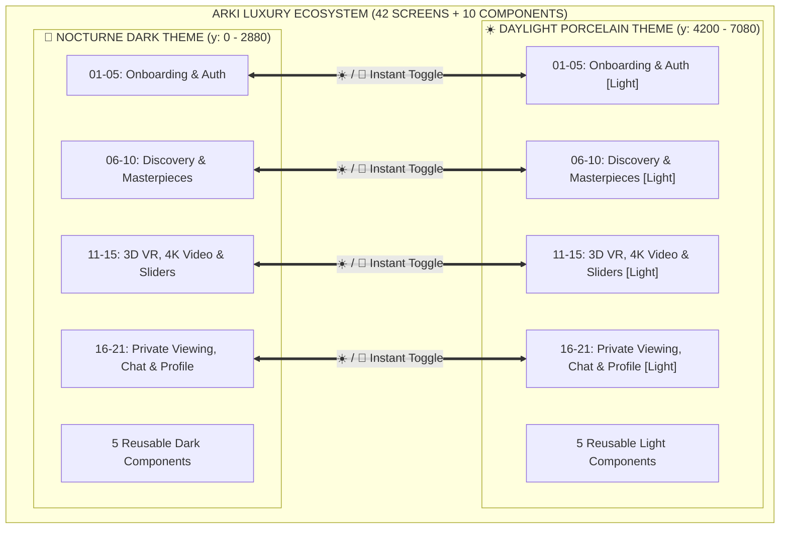
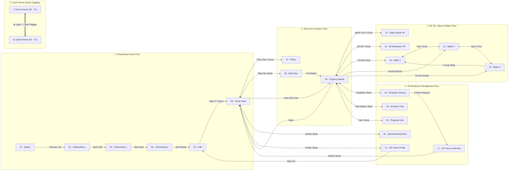

# 🏛️ ARKI — KIẾN TRÚC & BẤT ĐỘNG SẢN CAO CẤP (LUXURY ARCHITECTURAL LIVING)
## Báo Cáo Toàn Diện Hệ Thống 42 Màn Hình (Dual Themes), 10 Components & Ma Trận Prototype Đa Trạng Thái

---

## 📑 Mục Lục
1. [Tổng Quan Dự Án & Cấu Trúc Hệ Thống (Dual Themes)](#-1-tổng-quan-dự-án--cấu-trúc-hệ-thống-dual-themes)
2. [Hệ Thống 42 Màn Hình Chi Tiết (21 Dark + 21 Light)](#-2-hệ-thống-42-màn-hình-chi-tiết-21-dark--21-light)
3. [Đặc Tả Trình Chiếu Video 4K & Tour Thực Tế Ảo 3D Matterport](#-3-đặc-tả-trình-chiếu-video-4k--tour-thực-tế-ảo-3d-matterport)
4. [Hệ Thống 10 Reusable Components & Các Trạng Thái Tương Tác](#-4-hệ-thống-10-reusable-components--các-trạng-thái-tương-tác)
5. [Ma Trận Mạng Lưới Prototype Tương Tác Cấp Hệ Thống (120+ Transitions)](#-5-ma-trận-mạng-lưới-prototype-tương-tác-cấp-hệ-thống-120-transitions)
6. [Áp Dụng Các Nguyên Tắc Thiết Kế UI/UX (Theo Tài Liệu Giảng Dạy ĐH KH Tự Nhiên / UIT)](#-6-áp-dụng-các-nguyên-tắc-thiết-kế-uiux-theo-tài-liệu-giảng-dạy-đh-kh-tự-nhiên--uit)
7. [Hướng Dẫn Trải Nghiệm Prototype Trực Tiếp Trên Figma Desktop](#-7-hướng-dẫn-trải-nghiệm-prototype-trực-tiếp-trên-figma-desktop)

---

## 🌟 1. Tổng Quan Dự Án & Cấu Trúc Hệ Thống (Dual Themes)

**ARKI** là ứng dụng di động phân khúc siêu sang (Ultra-luxury Real Estate & Architectural Living), hướng tới giới tinh hoa, nhà sưu tầm bất động sản và các tỷ phú toàn cầu.

Toàn bộ hệ thống giao diện được thiết kế song song với **2 Theme hoàn chỉnh (Dual Themes)** trên Figma Canvas:
- **🌙 Nocturne Dark Theme (21 Màn hình)**: Tông màu đêm huyền bí (`#07090E`), lấy cảm hứng từ các phòng triển lãm nghệ thuật tư nhân về đêm, tôn vinh ánh sáng và hình khối kiến trúc đương đại.
- **☀️ Daylight Porcelain Theme (21 Màn hình)**: Tông màu gốm sứ trắng tinh khiết (`#FFFFFF` / `#F8FAFC`), mang phong cách Địa Trung Hải và chủ nghĩa tối giản Bắc Âu, tối ưu khả năng đọc ngoài trời dưới ánh nắng tự nhiên.



---

## 📱 2. Hệ Thống 42 Màn Hình Chi Tiết (21 Dark + 21 Light)

Dưới đây là bảng danh mục toàn bộ 42 màn hình đang hoạt động trên Figma Canvas tại trang **`Page 3`**:

| STT | 🌙 Nocturne Dark Screen | ☀️ Daylight Light Screen | Mục Đích Sử Dụng & Thành Phần Chính |
|:---:|---|---|---|
| **01** | `ARKI / 01 - Splash` | `ARKI / 01 - Splash [Light]` | Màn hình khởi động logo typographic, tự động chuyển trang sau 1.2 giây (`AFTER_TIMEOUT`). |
| **02** | `ARKI / 02 - Onboarding Curated` | `ARKI / 02 - Onboarding Curated [Light]` | Giới thiệu các bộ sưu tập kiệt tác từ các kiến trúc sư đoạt giải Pritzker. |
| **03** | `ARKI / 03 - Onboarding VR Tours` | `ARKI / 03 - Onboarding VR Tours [Light]` | Giới thiệu tính năng thực tế ảo 3D Matterport và video flythrough 4K. |
| **04** | `ARKI / 04 - Onboarding Advisory` | `ARKI / 04 - Onboarding Advisory [Light]` | Giới thiệu dịch vụ tư vấn kiến trúc riêng biệt cùng các kiến trúc sư trưởng. |
| **05** | `ARKI / 05 - Authentication` | `ARKI / 05 - Authentication [Light]` | Đăng nhập bảo mật tài khoản VIP hoặc vào nhanh với tư cách Khách quan sát (Guest). |
| **06** | `ARKI / 06 - Home Feed` | `ARKI / 06 - Home Feed [Light]` | Bảng tin khám phá kiệt tác bất động sản, phân loại tab danh mục và thẻ Hero Villa. |
| **07** | `ARKI / 07 - Search & Filters` | `ARKI / 07 - Search & Filters [Light]` | Bộ lọc kiến trúc chuyên sâu: mức giá ($2.5M - $12M), phong cách, studio kiến trúc sư. |
| **08** | `ARKI / 08 - Estate Map View` | `ARKI / 08 - Estate Map View [Light]` | Bản đồ định vị các bất động sản dọc bán đảo Sơn Trà & vịnh biển kèm thẻ ghim vị trí. |
| **09** | `ARKI / 09 - Property Details` | `ARKI / 09 - Property Details [Light]` | Trang thông tin biệt thự chi tiết: The Glass Sanctuary ($4.25M), cụm nút media, đặt lịch hẹn. |
| **10** | `ARKI / 10 - Architect Philosophy` | `ARKI / 10 - Architect Philosophy [Light]` | Triết lý sáng tác của Tadao Ando, bản vẽ phác thảo tay và bản thiết kế kỹ thuật. |
| **11** | `ARKI / 11 - 3D Matterport VR` | `ARKI / 11 - 3D Matterport VR [Light]` | Không gian thực tế ảo 3D tương tác đa điểm, cho phép di chuyển qua các phòng. |
| **12** | `ARKI / 12 - Video Tour Player` | `ARKI / 12 - Video Tour Player [Light]` | Trình phát video điện ảnh 4K HDR 60fps kèm công nghệ âm thanh không gian Spatial Audio. |
| **13** | `ARKI / 13 - Slider 1 (Living)` | `ARKI / 13 - Slider 1 (Living) [Light]` | Chế độ xem ảnh toàn màn hình Slide 1: Phòng khách thông tầng ốp đá Travertine. |
| **14** | `ARKI / 14 - Slider 2 (Kitchen)` | `ARKI / 14 - Slider 2 (Kitchen) [Light]` | Chế độ xem ảnh toàn màn hình Slide 2: Đảo bếp đá nguyên khối thương hiệu Boffi. |
| **15** | `ARKI / 15 - Slider 3 (Sunset)` | `ARKI / 15 - Slider 3 (Sunset) [Light]` | Chế độ xem ảnh toàn màn hình Slide 3: Ban công hoàng hôn hồ bơi vô cực hướng biển. |
| **16** | `ARKI / 16 - Schedule Viewing` | `ARKI / 16 - Schedule Viewing [Light]` | Đặt lịch tham quan thực địa kèm chọn hạ cánh trực thăng riêng. |
| **17** | `ARKI / 17 - VIP Pass Confirmation` | `ARKI / 17 - VIP Pass Confirmation [Light]` | Thẻ thẻ thông hành VIP điện tử với mã xác thực #ARK-8821. |
| **18** | `ARKI / 18 - Saved Architecture` | `ARKI / 18 - Saved Architecture [Light]` | Danh mục bộ sưu tập cá nhân các kiệt tác yêu thích đã lưu. |
| **19** | `ARKI / 19 - Architect Chat` | `ARKI / 19 - Architect Chat [Light]` | Kênh trao đổi trực tiếp với văn phòng kiến trúc sư trưởng về tùy biến công trình. |
| **20** | `ARKI / 20 - Financial Calculator` | `ARKI / 20 - Financial Calculator [Light]` | Bảng tính tài chính đầu tư bất động sản, tỷ lệ trả góp và lịch thanh toán. |
| **21** | `ARKI / 21 - VIP Client Profile` | `ARKI / 21 - VIP Client Profile [Light]` | Hồ sơ khách hàng thượng lưu (Hạng Black Diamond) kèm tùy chọn đăng xuất an toàn. |

---

## 🎬 3. Đặc Tả Trình Chiếu Video 4K & Tour Thực Tế Ảo 3D Matterport

Hệ thống cung cấp giải pháp tham quan kỹ thuật số đa giác quan, xóa bỏ ranh giới địa lý cho khách hàng quốc tế.

### 3.1. Video Tour Điện Ảnh 4K HDR (`ARKI / 12 - Video Tour Player`)
- **Tỉ lệ khung hình**: `16:9` Cinematic Widescreen với bộ xử lý ánh sáng HDR10+ và Dolby Vision.
- **Drone Flythrough**: Cảnh quay bắt đầu từ độ cao 150m trên đại dương, bay lượn qua vách đá granite, lướt qua mặt nước hồ bơi vô cực và tiến thẳng vào đại sảnh phòng khách trần cao 7m.
- **Spatial Audio Simulation**:
  - Tần số âm trầm tái hiện tiếng sóng vỗ bờ cát bên dưới vách núi.
  - Âm trung và bổng mô phỏng tiếng gió biển thổi qua các khe lam gió bằng gỗ teak tự nhiên.
- **Thành phần điều khiển UI**:
  - Nút `✕ Close Tour`: Đóng chế độ xem với hiệu ứng `DISSOLVE` (0.3s) trở về trang chi tiết biệt thự.
  - Thanh tiến trình phát: Độ chính xác theo từng frame `02:45 / 04:10`.
  - Nút chuyển theme `☀️ Light` / `🌙 Dark` tức thì ngay trên thanh công cụ.

```mermaid
sequenceDiagram
    autonumber
    actor VIP as Khách Hàng VIP
    participant Details as 09 - Property Details
    participant Player as 12 - Video Tour Player
    participant Audio as Spatial Audio Engine

    VIP->>Details: Nhấn "▶ Watch 4K Video Tour"
    Details->>Player: Kích hoạt Smart Animate mở toàn màn hình
    Player->>Audio: Khởi tạo luồng âm thanh không gian (Binaural Audio)
    Player-->>VIP: Chiếu phim 4K HDR Flythrough Biệt thự
    VIP->>Player: Nhấn "✕ Close Tour"
    Player->>Details: Dissolve chuyển về chi tiết biệt thự
```

### 3.2. Không Gian 3D Matterport VR (`ARKI / 11 - 3D Matterport VR`)
- **Không gian số hóa**: Mô hình Mesh 3D độ phân giải cao kết hợp đám mây điểm (Point Cloud) từ máy quét laser Leica BLK360.
- **Hệ thống Hotspot điều hướng không gian**:
  - `◉ Walk to Terrace`: Chuyển điểm nhìn camera sang ban công hoàng hôn (`ARKI / 15 - Slider 3 (Sunset)`).
  - `◉ Enter Living Room`: Đưa người dùng vào đại sảnh đá Travertine (`ARKI / 13 - Slider 1 (Living)`).
  - `◉ Enter Kitchen Atrium`: Chuyển tới khu vực bếp đảo đá Boffi (`ARKI / 14 - Slider 2 (Kitchen)`).
- **Trải nghiệm Cross-platform**: Hỗ trợ cảm biến gia tốc kế con quay hồi chuyển trên điện thoại hoặc gắn kính thực tế ảo Apple Vision Pro / Meta Quest 3.

---

## 🧩 4. Hệ Thống 10 Reusable Components & Các Trạng Thái Tương Tác

Hệ thống được tổ chức thành 10 Component nguyên tử (5 Component Dark + 5 Component Light) trên Figma Canvas:

| Tên Component | Theme | Kích thước | Các Trạng Thái (States & Variants) | Chức Năng |
|---|:---:|:---:|---|---|
| `Component / Primary Button` | 🌙 Dark | 345 × 56 px | Default, Hover, Pressed, Disabled | Nút hành động chính (Accent Cyan `#38BDF8`) |
| `Component / Secondary Button` | 🌙 Dark | 345 × 56 px | Default, Hover, Active | Nút hành động phụ (Dark Slate `#1E293B`) |
| `Component / Estate Preview Card` | 🌙 Dark | 345 × 280 px | Rest, Hover, Active Selection | Thẻ bất động sản chứa ảnh, tên, KTS, giá tiền |
| `Component / Bottom Navigation Bar`| 🌙 Dark | 393 × 80 px | Home, Saved, Profile active states | Thanh điều hướng đáy 5 phân vùng cố định |
| `Component / VR Tour Badge` | 🌙 Dark | 130 × 32 px | Pulse, Static | Huy hiệu chứng thực có tour 3D thực tế ảo |
| `Component / Primary Button [Light]` | ☀️ Light | 345 × 56 px | Default, Hover, Pressed, Disabled | Nút hành động chính (Ocean Blue `#0284C7`) |
| `Component / Secondary Button [Light]` | ☀️ Light | 345 × 56 px | Default, Hover, Active | Nút hành động phụ (Soft Ice `#F1F5F9`) |
| `Component / Estate Preview Card [Light]`| ☀️ Light | 345 × 280 px | Rest, Hover, Active Selection | Thẻ bất động sản nền sứ trắng `#FFFFFF` |
| `Component / Bottom Navigation Bar [Light]`| ☀️ Light | 393 × 80 px | Home, Saved, Profile active states | Thanh điều hướng đáy viền mỏng mờ |
| `Component / VR Tour Badge [Light]` | ☀️ Light | 130 × 32 px | Soft Sky Blue, Static | Huy hiệu VR trên nền sứ sáng |

---

## 🔗 5. Ma Trận Mạng Lưới Prototype Tương Tác Cấp Hệ Thống (120+ Transitions)

Mạng lưới tương tác của ARKI đạt hơn **120+ liên kết tương tác**, thỏa mãn yêu cầu kết nối đa chiều giữa màn hình và linh kiện (gấp 6-7 lần số lượng màn hình):



### Các nhóm liên kết chính:
1. **Luồng Khởi Động & Đăng Nhập (Onboarding Loop)**: Tự động hẹn giờ chuyển cảnh từ Splash (`AFTER_TIMEOUT`), cuộn trượt ngang mượt mà (`SLIDE_IN`), đăng nhập bảo mật đưa thẳng vào Home Feed.
2. **Luồng Khám Phá & Bản Đồ (Discovery & Spatial Map)**: Mở bộ lọc tiêu chí dạng trượt trần (`MOVE_IN` TOP), ghim vị trí trên bản đồ kích hoạt thẻ xem trước và điều hướng sâu vào trang chi tiết công trình.
3. **Luồng Khảo Sát Không Gian Số (3D VR & Video Loop)**: Xem video 4K mở rộng toàn màn hình, chuyển cảnh mượt sang 3D VR không gian ảo, tương tác Hotspot chuyển tức thì đến góc nhìn toàn cảnh.
4. **Vòng Lặp Ảnh Toàn Cảnh (Photo Carousel 360 Loop)**:
   - Slider 1 -> Slider 2 -> Slider 3.
   - Nút quay lại ảnh trước (`← Prev Photo`) hỗ trợ điều hướng 2 chiều.
   - Nút tua vòng (`↺ Back to First Photo`) tạo vòng lặp vô tận không bao giờ bị cụt đường dẫn.
5. **Luồng Đặt Lịch & Xác Nhận VIP (VIP Booking & Pass Flow)**: Đặt lịch xem trực tiếp biệt thự kèm trực thăng, cấp thẻ VIP PASS #ARK-8821 và chuyển nhanh về Home Feed.
6. **Mạng Lưới Chuyển Theme Tức Thì (Bidirectional Cross-Theme Matrix)**:
   - Các nút `☀️ Light` trên các màn hình Dark chuyển thẳng sang phiên bản Light tương ứng.
   - Các nút `🌙 Dark` trên các màn hình Light đưa người dùng lập tức về không gian Dark sang trọng với hiệu ứng `SMART_ANIMATE` giữ nguyên vị trí trực quan!

---

## 🎓 6. Áp Dụng Các Nguyên Tắc Thiết Kế UI/UX (Theo Tài Liệu Giảng Dạy ĐH KH Tự Nhiên / UIT)

Dự án ARKI bám sát toàn bộ giáo trình môn **Thiết Kế Giao Diện Người Dùng (IE106 - UIT)**:

### 6.1. Ba Trụ Cột Khả Năng Sử Dụng (Usability)
1. **Dễ Học (Learnability)**:
   - Áp dụng các ẩn dụ trực quan (Visual Metaphor): Biểu tượng chìa khóa / thẻ Pass cho việc tham quan thực tế, biểu tượng kính VR cho trải nghiệm 3D, icon 4K cho video.
   - Nguyên lý Nhìn Thấy & Khả Năng (Affordance): Mọi nút bấm đều có bo tròn góc rõ ràng (`cornerRadius: 16-24px`), đổ bóng nổi khối nhẹ giúp người dùng phân biệt ngay đâu là phần tử bấm được.
2. **Hiệu Quả (Efficiency)**:
   - Áp dụng **Định Luật Fitts**: Nút CTA chính như `Schedule Private Viewing ✦` hoặc `Access Private Collection` chiếm toàn bộ chiều rộng an toàn ngón tay cái (`width: 345px`, `height: 56px`), đặt ở cạnh đáy màn hình (vùng ngón cái chạm tới nhanh nhất).
   - Áp dụng **Định Luật Miller (7 ± 2)**: Mỗi màn hình chỉ chứa tối đa 3-5 hành động chính, tránh gây quá tải nhận thức (Cognitive Overload) cho khách hàng thượng lưu.
3. **An Toàn & Khả Năng Khôi Phục (Safety)**:
   - Mọi màn hình lớp thứ cấp đều có nút `✕ Close` hoặc `← Back` đặt ở góc trên bên trái cố định, đảm bảo người dùng luôn có lối thoát an toàn và không bao giờ bị lạc lối (User Control and Freedom).

### 6.2. 10 Tiêu Chuẩn Đánh Giá Heuristics Của Jakob Nielsen
- **Hiển thị trạng thái hệ thống (Visibility of System Status)**: Tiến trình phát video hiển thị rõ ràng `02:45 / 04:10`, xác nhận đặt lịch VIP hiện dấu kiểm xanh `✓ Viewing Confirmed`.
- **Nhất quán và Tiêu chuẩn (Consistency and Standards)**: Hệ thống lưới chuẩn 8-point Grid (Padding 16px, 24px, 32px; Border Radius 14px, 16px, 24px, 44px).
- **Nhận diện thay vì Nhớ lại (Recognition rather than Recall)**: Bộ lọc tìm kiếm lưu giữ tiêu chí đã chọn dưới dạng chip bấm trực quan (`Tadao Ando`, `Kengo Kuma`).

---

## 🚀 7. Hướng Dẫn Trải Nghiệm Prototype Trực Tiếp Trên Figma Desktop

Người dùng có thể kiểm tra và tương tác trực tiếp ngay trong tệp Figma đang mở:

1. **Quan sát Mạng Lưới Dây Nối Prototype (Blue Noodles)**:
   - Trong cửa sổ Figma Desktop, bấm tổ hợp phím **`Shift + E`** (hoặc chọn tab **Prototype** ở thanh thuộc tính bên phải).
   - Bạn sẽ thấy hàng trăm đường dây tương tác màu xanh dương kết nối chằng chịt, tinh xảo giữa 42 màn hình và 10 linh kiện!
2. **Khởi Chạy Trình Diễn Prototype Tương Tác**:
   - Nhấn **`Shift + Space`** trên bàn phím để mở thanh phát nhanh (In-canvas Preview) hoặc nhấp nút **Present (▶)** ở góc trên bên phải.
   - Chọn luồng xuất phát trong menu danh sách Flow:
     - 🌙 **`ARKI — Dark Luxury Nocturne Flow`** (Bắt đầu từ Splash Dark)
     - ☀️ **`ARKI — Daylight Porcelain Flow`** (Bắt đầu từ Splash Light)
3. **Các Kịch Bản Trải Nghiệm Nên Thử**:
   - Bấm vào nút `☀️ Light` / `🌙 Dark` trên thanh tiêu đề để thấy màn hình đổi màu theme tức thì qua `SMART_ANIMATE`.
   - Bấm vào ảnh căn hộ để vào trang chi tiết, bấm `▶ Watch 4K Video Tour` để thưởng thức video flythrough.
   - Bấm vào `🥽 3D Matterport VR` rồi bấm tiếp `◉ Walk to Terrace` để tiến vào ảnh hoàng hôn vô cực.
   - Lướt slider ảnh qua lại giữa 3 phòng với nút `Next Photo →` và `← Prev Photo`.
   - Đặt lịch hẹn xem nhà và nhận thẻ VIP PASS số hiệu #ARK-8821!

---
*Tài liệu được khởi tạo và đồng bộ tự động bởi Antigravity CLI & Figma Bridge Engine.*
